# Полная продуктовая сверка Vet.AF и TemichevVet CRM

Дата: 29 июля 2026 года
TemichevVet: коммит `84a6f69041f1d390c3f5227da5fb0a9d27ed173d`

## 1. Короткий вывод

**Vet.AF сегодня сильнее как зрелая тиражируемая облачная ветеринарная платформа. TemichevVet уже сильнее как локальная CRM одной клиники с контролем данных, безопасным переносом и возможностью быстро подстроить медицинские сценарии под реальную работу врачей.**

По взвешенной продуктовой модели:

| Продукт | Итоговая оценка | Уверенность | Как читать результат |
| --- | ---: | --- | --- |
| Vet.AF | **90% ± 5%** | Средняя | Публичные страницы проверены 29.07.2026; защищённый кабинет не открылся без повторного входа, поэтому внутренние сценарии дополнены структурным аудитом от 18.06.2026 и не выдаются за заново проверенные |
| TemichevVet | **80% ± 3%** | Высокая | Проверены текущий интерфейс на MacBook, исходный код, схема данных, 233 endpoint, 89 моделей и 91 автоматический сценарий |

Главный разрыв TemichevVet сейчас не в наличии основных модулей. Основные модули уже есть. Разрыв — в **операционной зрелости товаров и документов**:

- каталог после импорта заполнен неоднородно: много пустых категорий, нулевых цен и препаратов в литрах;
- несколько штрих-кодов попали в одно поле через `;`, поэтому корректная печать каждого реального кода не гарантируется;
- складские документы реализованы архитектурно, но текущий журнал пуст и не подтверждает ежедневное использование;
- документы создаются из шаблонов и печатаются, но редактор остаётся текстовым;
- отсутствует рабочая загрузка сканов, PDF, JPG и DOCX в карту пациента или приём;
- отсутствуют версии шаблонов и настоящая электронная подпись.

При закрытии только этих двух контуров TemichevVet может подняться примерно с **80% до 86%** без копирования всей Vet.AF.

## 2. Что именно проверено

### Vet.AF

- актуальная публичная главная;
- актуальная публичная таблица сравнения;
- актуальная страница возможностей для руководителей и врачей;
- актуальная страница тарифа;
- попытка открыть защищённый кабинет в текущей сессии;
- ранее зафиксированная структура защищённых экранов товаров, поставок, документов, приёма, лаборатории, прав и отчётов.

Ограничение: текущая сессия Vet.AF потребовала телефон и пароль. Логин и пароль не вводились. Поэтому утверждения о защищённой части имеют среднюю уверенность и помечены как такие.

### TemichevVet

- текущая локальная CRM `http://localhost:3000` на MacBook;
- сводка директора и левое меню;
- каталог товаров и редактор товара;
- складские документы;
- текстовые и составные шаблоны;
- перенос данных;
- лабораторные профили;
- встроенная инструкция;
- маршруты, права, Prisma-схема, API, тесты;
- реализация товара, партии, движения, счёта, списания, шаблонов, импорта и печати.

## 3. Методика процентов

Это не доля рынка и не «научная точность». Это управленческая оценка по десяти областям. Каждая область оценивалась от 0 до 5 и переводилась в проценты. Итог — сумма с учётом веса области.

| Область | Вес | Vet.AF | TemichevVet | Лидер сейчас |
| --- | ---: | ---: | ---: | --- |
| Клиническое ядро приёма | 15% | 94% | 90% | Vet.AF, небольшой разрыв |
| Владельцы, пациенты, расписание, очередь | 10% | 92% | 88% | Vet.AF |
| Стационар и лаборатория | 10% | 94% | 84% | Vet.AF |
| Товары, склад, закупки | 15% | 86% | 68% | Vet.AF |
| Документы, файлы, шаблоны, печать | 12% | 92% | 62% | Vet.AF |
| Финансы, кассы, зарплата, отчёты | 13% | 96% | 82% | Vet.AF |
| Сообщения и кабинет владельца | 7% | 90% | 76% | Vet.AF |
| Импорт, экспорт и перенос | 6% | 68% | 94% | **TemichevVet** |
| Права, аудит, резервирование | 7% | 82% | 92% | **TemichevVet** |
| UX, обучение, мобильность | 5% | 88% | 78% | Vet.AF в мобильности; TemichevVet в инструкции |
| **Взвешенный итог** | **100%** | **90%** | **80%** | Vet.AF по ширине и зрелости |

## 4. Сравнение по ключевым модулям

| Контур | Vet.AF | TemichevVet | Что лучше | Что нужно TemichevVet |
| --- | --- | --- | --- | --- |
| Сводка | Настраиваемая сводка и более 20 отчётов заявлены официально | Сводка директора, бизнес, прибыль, очередь, расписание, оплаты, стационар, склад, лаборатория | Vet.AF шире; TemichevVet компактнее для одной клиники | Настраиваемые карточки и больше готовых отчётов |
| Владельцы | Карточка, доверенные лица, депозит, история | Карточка, доверенные лица, депозит, портал, импорт с дедупликацией | Сопоставимо; TemichevVet сильнее в переносе | Массовая очистка дублей после миграции |
| Пациенты | Профиль, вакцинации, история, статусы | Профиль, вес, вакцинации, диагнозы, история | Сопоставимо | Быстрее открывать длинную историю, больше массовых операций |
| Расписание | Мастер записи, настройки врача и длительности | Расписание, смены, онлайн-заявки, явная кнопка «Открыть» | Vet.AF зрелее в персональных настройках | Плотный календарь и подтверждения/напоминания |
| Очередь | Электронная очередь, сотрудник, кабинет, срочность | Живая очередь и отдельный клиентский экран | TemichevVet понятнее разделяет запись и живую очередь | Аналитика времени ожидания |
| Приём | Богатый редактор, боковой контекст, документы, анализы, стационар | Осмотр, диагнозы, рекомендации, товары, документы, лаборатория, стационар | Ядро сопоставимо | Rich text, вложения и быстрый контекст истории |
| Стационар | Боксы и назначения; зрелая модель уведомлений | Отдельное пребывание, записи наблюдения, поиск без статуса, независимость от приёма | TemichevVet исправил критическую связь приёма и стационара | Почасовой лист назначений, контроль выполнения процедур |
| Лаборатория | Более 100 преднастроек и Vet Union заявлены официально | Анализы, профили до 20 позиций, результаты, связанная услуга | Vet.AF | Внешняя лаборатория, импорт результатов, больше стартовых профилей |
| Счета | Фильтры, долги, депозит, оплаты | Частичные оплаты, возврат, депозит, срок оплаты, понятная кнопка оплаты | Сопоставимо | Фискальная интеграция и закрытая приёмка реальных чеков |
| Продажи | Отдельны от приёма | Отдельны от приёма, связаны со счётом и FIFO-списанием | TemichevVet технически силён | Сканер, быстрый кассовый режим |
| Склад | Товары, услуги, поставки, партии, места хранения, загрузка поставки | Товары, услуги, партии, поставщики, накладные, 6 типов документов | Vet.AF по текущей эксплуатации | Нормализовать каталог и добавить загрузчик накладных |
| Документы | Шаблоны, переменные, rich editor, загрузка файлов по ранее проверенному кабинету | Текстовые, составные, уведомления, переменные, печать, отправка | Vet.AF | Файлы, WYSIWYG, версии, подпись |
| Отчёты | Более 20 отчётов, 13 методов зарплаты | 6 областей отчёта, Excel/PDF, P&L, закрытие дня, 4 базовых компонента зарплаты | Vet.AF | Расширить библиотеку отчётов и правила зарплаты |
| Роли | Глубокие персональные настройки сотрудника | Роли, точечные права, персональные исключения, склады, аудит | Сопоставимо; TemichevVet прозрачен для директора | Матрица E2E всех ролей |
| Кабинет владельца | Запись, история и чат заявлены официально; нативные магазины приложений | PWA, история, документы, сообщения, приглашение по QR/ссылке | Vet.AF шире и зрелее | Принять push на iPhone и реальные внешние каналы |
| Импорт | В защищённой части видна загрузка поставок и файлов | Универсальный загрузчик данных с предпросмотром, дедупликацией и откатом | **TemichevVet** | PDF/OCR и блокировка отката после окончательной приёмки |
| Автономность | Облако, зависимость от интернета и тарифа | Локальный сервер, клиника контролирует базу и резервные копии | **TemichevVet** | Регламент восстановления и мониторинг на TECNO |
| Инструкция | Публично заявлена простота освоения | 17 подробных разделов с ролями, поиском и печатью PDF | **TemichevVet** | Добавить реальные мини-скриншоты и подсказки прямо в формах |

## 5. Товары и склад — подробная сверка

### 5.1 Карточка товара

| Возможность | Vet.AF | TemichevVet сейчас | Вывод |
| --- | --- | --- | --- |
| Название и категория | Есть | Есть готовые категории; можно ввести новую, она создастся автоматически | Форма TemichevVet стала понятной, но текущие импортированные карточки почти без категорий |
| Артикул / SKU | Есть | Есть | Паритет |
| GTIN | Отдельное поле | Остался в модели, но отдельное техническое поле скрыто из обычной формы | Решение TemichevVet понятнее сотруднику |
| Реальный штрих-код упаковки | Есть | Можно ввести цифры; сканер не обязателен | Паритет для ручного ввода |
| Внутренний штрих-код | Не подтверждено заново | Можно сгенерировать EAN-13 | Плюс TemichevVet |
| Несколько штрих-кодов | Ранее наблюдались штрих-коды во множественном числе | Одно строковое поле; после импорта встречается `код1;код2` | Критический разрыв TemichevVet |
| Цена | Фиксированная цена или наценка | Цена за отдельную единицу начисления | TemichevVet лучше решает «0,5 мл списать, 1 инъекцию продать» |
| Единица хранения | Есть | Выбор: штука, упаковка, флакон, ампула, мл, л, г, кг и др. | Паритет |
| Единица списания | Есть | Отдельный выбор и коэффициент пересчёта | Паритет или небольшой плюс TemichevVet |
| Единица начисления | Не выделена как отдельный третий слой в ранее увиденной форме | Отдельно: инъекция, процедура, доза, мл, штука и др. | Плюс TemichevVet |
| Количество в упаковке | Есть | Есть при разных единицах хранения и списания | Паритет |
| Минимальный остаток | Есть | Есть | Паритет |
| Срок годности | Есть | Дата по умолчанию плюс фактический срок каждой партии | Хорошая модель TemichevVet |
| НДС | Есть | Есть | Паритет |
| Редактирование | Есть | Кнопка «Изменить» в каждой строке | Паритет |
| Печать ценника | Есть | Редактор ценника, юридическое лицо, клиника, цена, настоящий штрих-код | TemichevVet функционально готов, но данные штрих-кодов нужно очистить |

### 5.2 Что видно в текущем каталоге TemichevVet

Текущий экран подтверждает не только новые возможности, но и незавершённость миграции каталога:

- категория у большинства видимых товаров — `—`;
- у части препаратов цена `0,00 ₽`;
- инъекционные препараты отображаются в `л`, а не в `мл`;
- несколько кодов объединены через точку с запятой;
- список слишком широк: на рабочем экране правые столбцы и действия визуально сжаты;
- новые кнопки редактирования и печати есть;
- единица цены выводится рядом с ценой, что стало понятнее.

Это означает: **модель товара уже правильнее ранней версии, но сам рабочий каталог ещё не принят как чистый справочник**.

### 5.3 Складские документы

TemichevVet уже имеет:

- приёмку и накладные;
- партии и сроки годности;
- инвентаризацию;
- перемещение между складами;
- возврат поставщику;
- списание;
- пересортицу;
- корректировку;
- черновик, проведение и отмену черновика;
- поставщиков и взаиморасчёты;
- оплату поставщику из выбранной кассы;
- историю движения и аудит действий.

Архитектурно это сильный контур. Но текущий экран документов пуст. Следовательно, нельзя считать его принятым в ежедневной клинике только потому, что таблицы и API существуют.

### 5.4 Чего не хватает относительно зрелого склада Vet.AF

1. Загрузчика накладной поставщика из XLS/XLSX/CSV.
2. Привязки оригинала PDF/JPG/DOCX к приёмке.
3. Нормального справочника нескольких штрих-кодов товара.
4. Массового мастера очистки импортированного каталога.
5. Быстрого режима сканирования для кассы и инвентаризации.
6. Проверенной схемы возврата и инвентаризации на реальных данных клиники.
7. Настраиваемых колонок и закреплённой колонки действий.

### 5.5 Обязательный приёмочный сценарий товара

До коммерческой приёмки нужно воспроизводимо пройти сценарий:

1. Принять флакон 100 мл с серией и сроком годности.
2. Установить цену 40 ₽ за одну инъекцию.
3. В приёме начислить одну инъекцию на 40 ₽.
4. Списать со склада 0,5 мл.
5. Получить остаток 99,5 мл.
6. Увидеть правильную себестоимость, движение партии и сумму счёта.
7. Напечатать ценник с реальным штрих-кодом упаковки.

Этот сценарий должен быть и ручным приёмочным тестом, и автоматическим E2E-тестом.

## 6. Документы и загрузчики — подробная сверка

| Возможность | Vet.AF | TemichevVet | Оценка TemichevVet |
| --- | --- | --- | ---: |
| Текстовые шаблоны | Есть | Есть, включая быстрые фразы | 90% |
| Категории шаблонов | Есть | Есть | 90% |
| Переменные пациента, владельца, клиники | Есть | Есть | 90% |
| Составные печатные документы | Есть | Есть | 85% |
| Предпросмотр и печать | Есть | Есть | 85% |
| Статусы документа | Есть | Черновик, сформирован, подписан, отменён | 75%: статус есть, настоящей подписи нет |
| Отправка владельцу | Есть | Через очередь уведомлений | 80% |
| Rich text: таблицы, форматирование, разрыв страницы | Есть по ранее проверенному редактору | Нет, используется обычное текстовое поле | 35% |
| Загрузка файла с устройства в приём | Есть по ранее проверенному защищённому кабинету | Нет рабочего UI и API | 0% |
| Загрузка лабораторного результата | Есть по ранее проверенному кабинету и интеграции Vet Union | Нет общего загрузчика результата-файла | 10% |
| PDF/JPG/PNG/DOCX как вложение | Есть как пользовательский сценарий загрузки | Модель `FileObject` существует, но рабочего контура нет | 10% |
| Версии шаблонов | Не подтверждено | Нет | 0% |
| Электронная подпись | Не подтверждено как юридически значимая | Нет; поле статуса не равно подписи | 0% |
| Поиск по документам пациента | Ограниченно подтверждено | Документы видны внутри приёма и истории | 60% |
| Массовая загрузка старого архива | Не подтверждено | Нет | 0% |

Критически важно различать два загрузчика:

- **перенос табличных данных** — в TemichevVet реализован хорошо;
- **загрузка медицинского документа или скана** — в TemichevVet пока не реализована.

Формат DOCX в экране «Перенос данных» означает чтение таблицы Word для импорта строк. Это не загрузка документа в карту пациента.

### Рекомендуемая модель документов TemichevVet

1. `Шаблон` — редактируемый макет с версиями.
2. `Сформированный документ` — неизменяемый снимок конкретной версии шаблона.
3. `Загруженный файл` — оригинал PDF/JPG/PNG/DOCX с контрольной суммой.
4. `Подпись` — отдельное событие с сотрудником/владельцем, временем и способом подтверждения.
5. `Отправка` — отдельная очередь доставки с результатом канала.
6. `Аудит` — кто создал, изменил, распечатал, подписал, отправил или скачал.

## 7. Перенос данных и импорт

TemichevVet здесь объективно сильнее своей текущей стадии продукта.

| Возможность | TemichevVet |
| --- | --- |
| Форматы | XLS, XLSX, CSV, TSV, TXT, таблицы DOCX |
| Автоопределение | Определяет клиентов/пациентов, историю, каталог, остатки |
| Автосопоставление | Колонки сопоставляются по названию и по содержимому |
| Ручное сопоставление | Есть как дополнительный режим |
| Безопасный предпросмотр | Запись не начинается до отдельного подтверждения |
| Контрольные отчёты | Распознаются и блокируются как не предназначенные для импорта |
| Дубли | Ищутся повторные строки и существующие карточки |
| Ошибки | Можно скачать CSV проблемных строк |
| Журнал | Сохраняются файл, раздел, количество строк, статус |
| Откат | Пакет можно отменить при соблюдении защитных условий |
| Контрольная сумма | SHA-256 файла рассчитывается до переноса |

На текущем экране видны завершённые партии на 19 250 строк клиентов/пациентов, 724 строки каталога и 248 строк услуг. Это подтверждает практическую масштабируемость загрузчика, но одновременно показывает необходимость последующей нормализации товара.

Чего ещё не хватает:

- OCR и PDF для входящих накладных;
- загрузки медицинских файлов в карту;
- режима «пакет окончательно принят», после которого кнопка отката скрывается или блокируется;
- отчёта качества после переноса: процент заполненных категорий, цен, единиц, штрих-кодов и дублей.

## 8. Финансы, отчёты и коммерческая зрелость

### Vet.AF сильнее

- официально заявлены более 20 отчётов;
- официально заявлены 13 методов расчёта зарплаты;
- зрелый облачный тариф и лимиты пользователей;
- мобильные приложения и внешние интеграции;
- Vet Union и автоматическое попадание результатов в историю.

### TemichevVet уже реализовал

- счета, частичные оплаты, возвраты и депозит;
- продажи отдельно от приёма;
- кассы и способы оплаты;
- закрытие дня с согласованием директором;
- доходы, расходы, валовую и операционную прибыль;
- поставщиков и их оплаты;
- 6 областей управленческого отчёта: финансы, посещаемость, товары/услуги, сотрудники, вакцинации, склад;
- Excel и печать/PDF;
- зарплату из фиксированной части, смен, процентов услуг и товаров, специальных правил и корректировок.

### Чего не хватает TemichevVet

1. Фискальной кассы и проверенного сценария с реальным оборудованием.
2. Набора готовых отчётов уровня Vet.AF.
3. Расширенной зарплатной формулы и конструктора правил.
4. Проверки P&L и себестоимости на полностью закрытом реальном месяце.
5. Аналитики времени ожидания, возвратности клиентов и загрузки врачей.
6. План-факт бюджета и прогнозирования денежных разрывов.

### Стоимость и совокупные расходы

| Параметр | Vet.AF | TemichevVet |
| --- | --- | --- |
| Публичный тариф | 30 ₽ в день за пользователя | Коммерческий тариф ещё не зафиксирован |
| Один пользователь в год | 10 950 ₽ по текущему калькулятору | Нет отдельной пользовательской подписки в текущем локальном комплекте |
| Три пользователя | Публичная таблица сравнения показывает 29 200 ₽ в год; линейный расчёт 30 ₽ × 365 × 3 даёт 32 850 ₽, поэтому условия скидки нужно уточнять | Нельзя честно сравнить до утверждения цены поддержки и обновлений |
| Хранилище | 1 000 MB включено по текущему калькулятору | Ограничено дисками локального сервера и политикой резервирования |
| Инфраструктура | Облако поставщика | TECNO, диски, электричество, локальная сеть, резервный носитель |
| Поддержка | Входит в отношения с SaaS-поставщиком | Нужны формальный SLA, канал поддержки, сроки реакции и регламент обновлений |
| Риск остановки | Интернет или внешний сервис | Локальный сервер, сеть, питание или диск |
| Контроль базы | У поставщика облака | У клиники |

Функциональная оценка выше не включает цену. Для коммерческого решения нужно считать отдельно: лицензия/поддержка, оборудование, резервирование, время администратора и стоимость простоя.

## 9. Что TemichevVet уже делает лучше Vet.AF

| Преимущество | Почему это важно клинике |
| --- | --- |
| Локальная работа без постоянного интернета | Приёмы, очередь, счета, склад и стационар не останавливаются при проблеме внешней связи |
| Владение данными и резервными копиями | Клиника контролирует базу и физический сервер |
| Безопасный универсальный перенос | Предпросмотр, дедупликация, журнал, список ошибок и откат |
| Отдельные количество к оплате и складское списание | Правильно моделирует инъекцию и фактически использованный объём |
| Директорское закрытие дня | Повседневная финансовая дисциплина встроена в CRM |
| Изолированный кабинет владельца | Публичная поверхность не получает прямой доступ к клинической базе |
| Подробная русская инструкция | 17 разделов, поиск, фильтр по ролям и печать PDF |
| Быстрая продуктовая адаптация | Реальные ошибки клиники можно исправлять быстрее, чем ждать общерыночный релиз SaaS |

## 10. Где Vet.AF заметно лучше

| Преимущество | Разрыв TemichevVet |
| --- | --- |
| Многолетняя эксплуатационная зрелость | В TemichevVet часть контуров ещё не прошла длинную реальную эксплуатацию |
| Богатые документы и загрузка файлов | В TemichevVet пока обычный текстовый редактор и нет вложений |
| Лабораторная экосистема | Нет Vet Union и внешних лабораторных API |
| Более 20 отчётов | У TemichevVet 6 основных областей отчёта |
| 13 методов зарплаты | У TemichevVet меньше базовых механизмов |
| Мобильные приложения | TemichevVet опирается на веб/PWA |
| Готовая облачная эксплуатация и SaaS | TemichevVet требует собственного сервера, регламента обновления и поддержки |
| Проверенные поставки и справочники | Каталог TemichevVet после миграции требует очистки |

## 11. Приоритетный продуктовый бэклог

### P0 — блокирует уверенное коммерческое использование

| № | Задача | Критерий готовности | Эффект на оценку |
| ---: | --- | --- | ---: |
| 1 | Мастер нормализации каталога | Не менее 95% активных товаров имеют категорию; нет инъекционных препаратов в литрах без явного решения; нулевые цены вынесены в отдельный список | +2,0 п.п. |
| 2 | Отдельная сущность нескольких штрих-кодов | Каждый код хранится отдельно, один отмечен основным, поиск находит любой, ценник печатает выбранный настоящий код | +1,0 п.п. |
| 3 | Загрузчик накладной | XLS/XLSX/CSV → предпросмотр → поставщик → партии → сроки → цены → проведение | +1,0 п.п. |
| 4 | Медицинские вложения | PDF/JPG/PNG/DOCX загружаются в приём/пациента, сохраняются в MinIO, имеют размер, тип, SHA-256, права и аудит | +1,5 п.п. |
| 5 | Rich text редактор документов | Форматирование, таблицы, списки, разрыв страницы, переменные, предсказуемая печать A4 | +1,0 п.п. |
| 6 | E2E «инъекция 40 ₽ / списание 0,5 мл» | Цена, счёт, партия, остаток, себестоимость и отчёт совпадают | +0,5 п.п. |
| 7 | Приёмка склада на реальных сценариях | Приёмка, возврат, инвентаризация, списание, перемещение и пересортица проверены директором | Без неё склад остаётся непроверенным |

### P1 — нужен для зрелого коммерческого продукта

| № | Задача | Результат |
| ---: | --- | --- |
| 8 | Версии шаблонов | Старые документы сохраняют вид и текст своей версии |
| 9 | Подпись документа | Отдельное подтверждение сотрудника/владельца, а не ручная смена статуса |
| 10 | Загрузка результата лаборатории | Файл и структурированные показатели попадают в историю пациента |
| 11 | Внешняя лабораторная интеграция | Адаптер хотя бы одного реального провайдера |
| 12 | Библиотека отчётов | Довести до 12–15 готовых отчётов до попытки догонять 20+ Vet.AF |
| 13 | Конструктор зарплаты | Условия по услуге, товару, роли, смене, выручке и порогам |
| 14 | Быстрый кассовый режим | Сканирование, добавление позиции, оплата и чек без переходов по длинной карточке |
| 15 | Контекстные подсказки | Ссылки на конкретный раздел инструкции прямо возле сложного поля |
| 16 | Финальная приёмка Windows/TECNO | Проверены обновление, восстановление backup, LAN-доступ, печать и работа нескольких компьютеров |

### P2 — расширение рынка

- IP-телефония;
- OCR бумажных документов;
- нативные мобильные приложения при доказанной необходимости;
- AI-помощник врача только после стабилизации данных;
- сложная многоклиничная сеть и центральный склад;
- публичное API и каталог интеграций;
- план-факт, бюджетирование и прогнозирование.

## 12. Рекомендуемая стратегия

TemichevVet не нужно превращать в копию Vet.AF. Рациональная позиция продукта:

> **«Локальная ветеринарная CRM, которая не останавливает клинику без интернета, безопасно принимает данные из другой системы и точно учитывает реальные медицинские процессы»**.

Следующий продуктовый этап должен быть не «добавить ещё десять экранов», а:

1. очистить и принять текущий каталог;
2. закончить товарный контур реальной накладной;
3. сделать настоящие медицинские вложения;
4. заменить текстовый редактор документов на полноценный;
5. пройти день работы врача, администратора и директора на MacBook;
6. затем отдельно принять тот же день на Windows/TECNO без изменения клинических данных в ходе теста.

## 13. Экранные доказательства текущей проверки

### Шаг 1. Публичное позиционирование Vet.AF

Общее состояние: зрелая публичная SaaS-подача, но маркетинговая страница не доказывает работу защищённых сценариев.

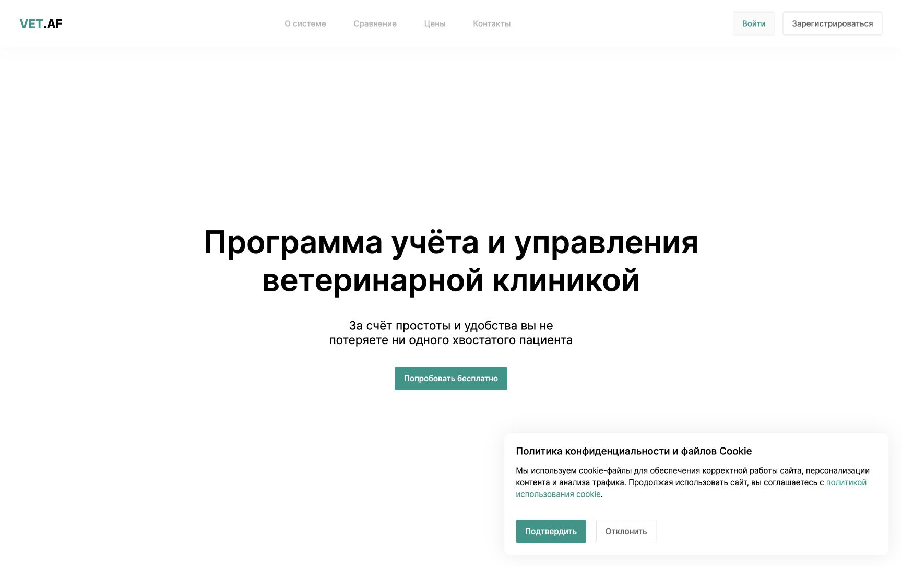

### Шаг 2. Текущая таблица сравнения Vet.AF

Общее состояние: широкий заявленный набор — мобильность, облако, очередь, лаборатория, кабинет, чат и зарплата. Таблица является материалом самого производителя, а не независимым сравнением.

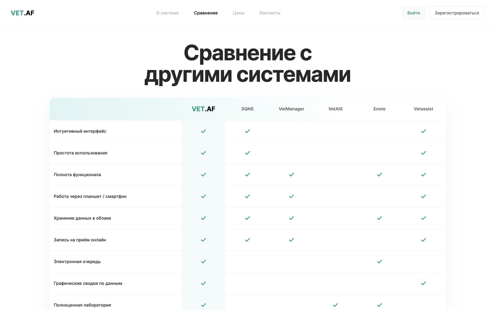

Блокер: защищённая часть потребовала повторный телефон и пароль. В текущей проверке повторный вход не выполнялся.

### Шаг 3. Сводка TemichevVet

Общее состояние: рабочая роль-ориентированная сводка; главные клинические и финансовые контуры доступны из одного экрана.

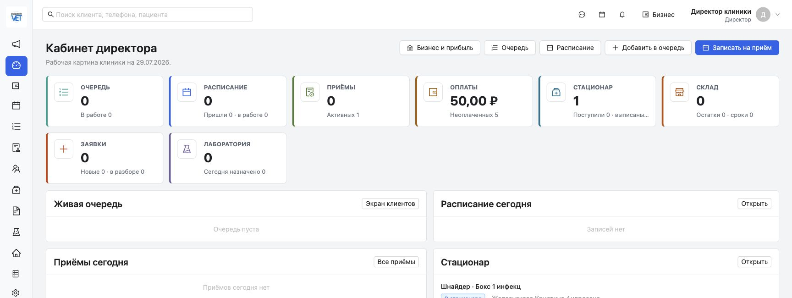

### Шаг 4. Текущий каталог товаров

Общее состояние: редактирование и ценники появились, но данные каталога ещё не нормализованы.

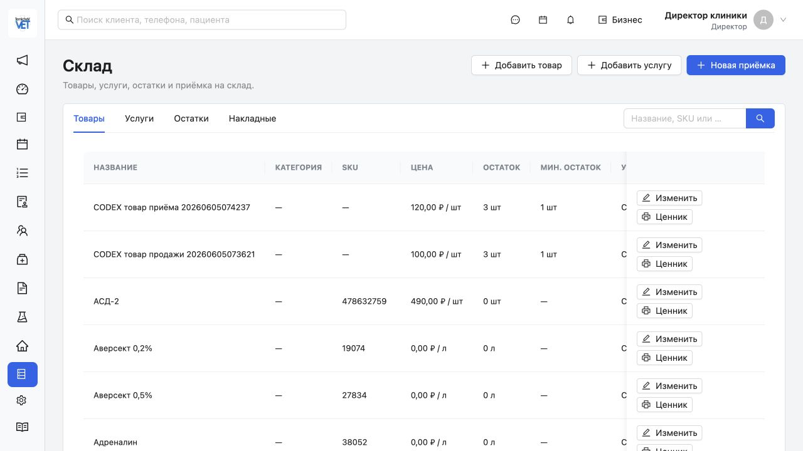

### Шаг 5. Редактор товара

Общее состояние: правильное разделение хранения, списания и начисления; форма стала понятнее, чем ранняя версия.

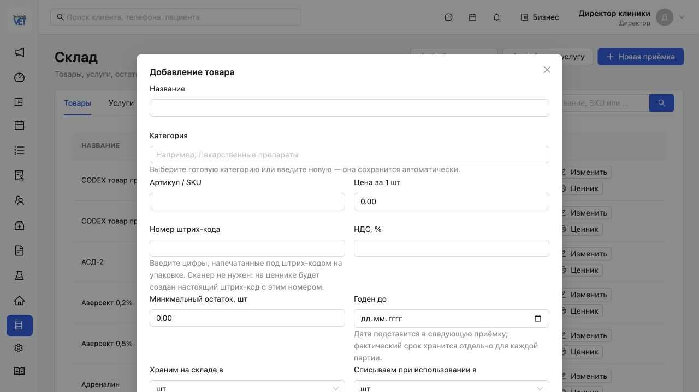

### Шаг 6. Складские документы

Общее состояние: архитектура зрелая, текущий журнал пуст — эксплуатация не доказана.

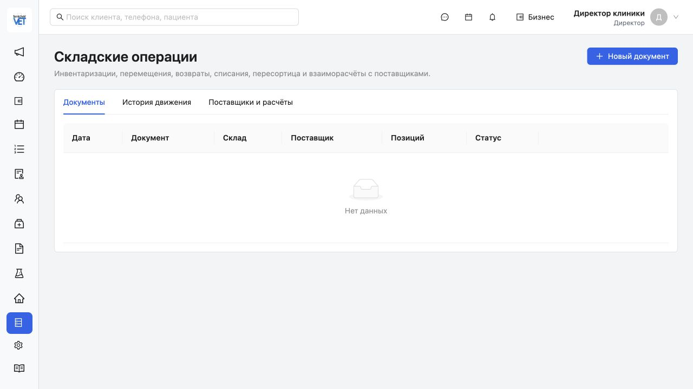

### Шаг 7. Текстовые шаблоны

Общее состояние: много готовых клинических фраз, но таблица перегружена по ширине.

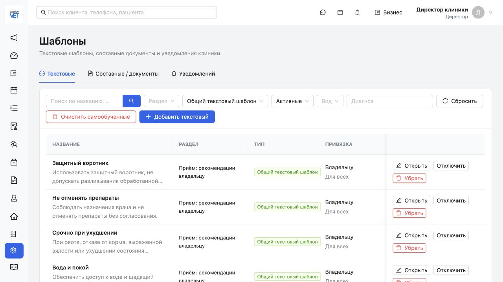

### Шаг 8. Составные документы

Общее состояние: переменные, категории и печать работают как основа документооборота.

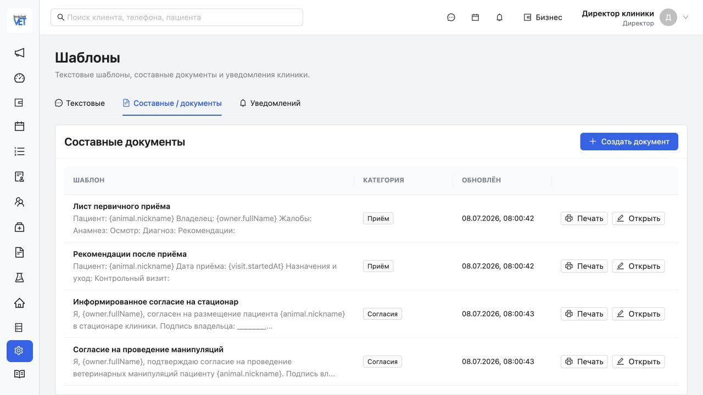

### Шаг 9. Перенос данных

Общее состояние: один из самых сильных модулей TemichevVet — безопасный предпросмотр, журнал и откат.

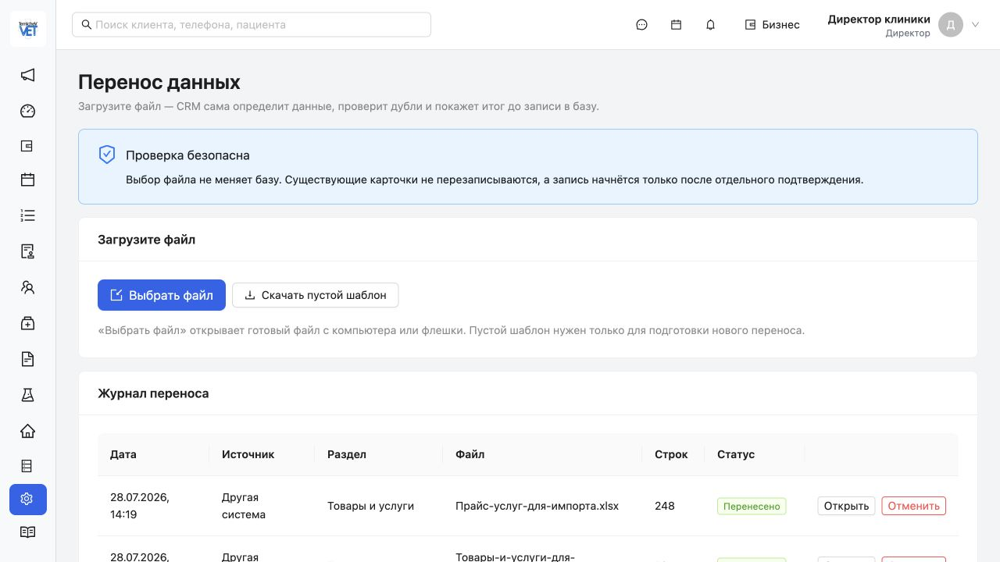

### Шаг 10. Лабораторные профили

Общее состояние: профиль из нескольких анализов реализован и связан с услугой.

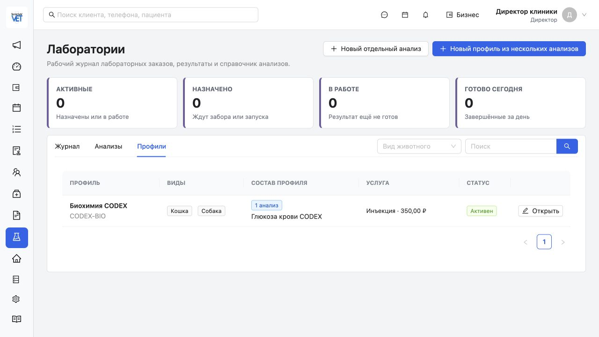

### Шаг 11. Инструкция

Общее состояние: сильный коммерческий плюс — подробный учебный контур внутри CRM.

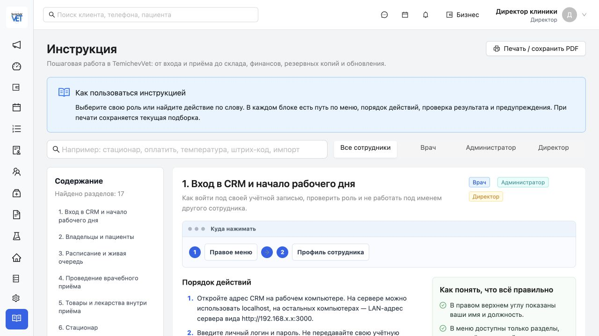

## 14. Источники и границы уверенности

- текущие скриншоты TemichevVet и Vet.AF из этой папки;
- текущий исходный код TemichevVet на коммите `84a6f69`;
- официальные страницы Vet.AF: `https://vetaf.ru/about`, `https://vetaf.ru/comparison`, `https://vetaf.ru/prices`;
- структурный аудит защищённого интерфейса Vet.AF от 18.06.2026 — только как дополнительный контекст;
- не выполнялись изменения данных, Docker, сервера, Windows/TECNO или флешки;
- не проводилась юридическая оценка соответствия требованиям закона, фискализации или электронной подписи; для коммерческого выпуска это отдельная профессиональная проверка.
