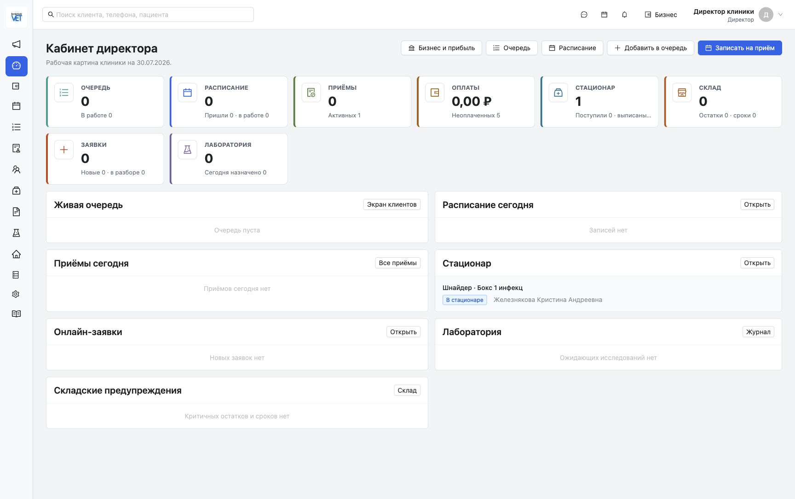
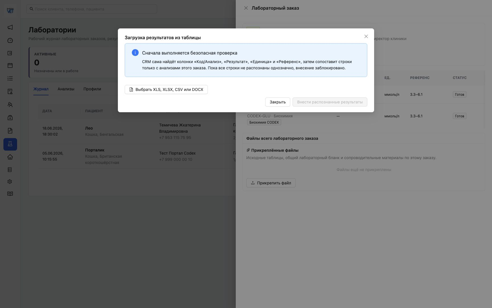
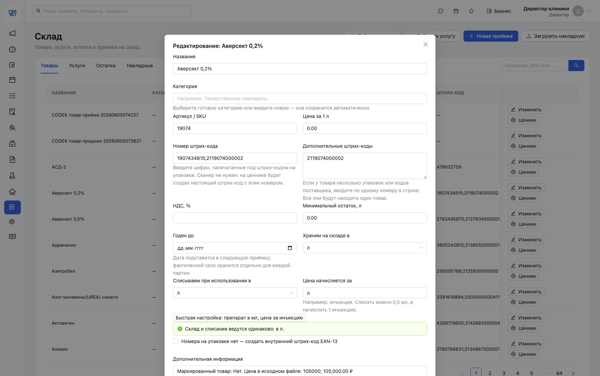
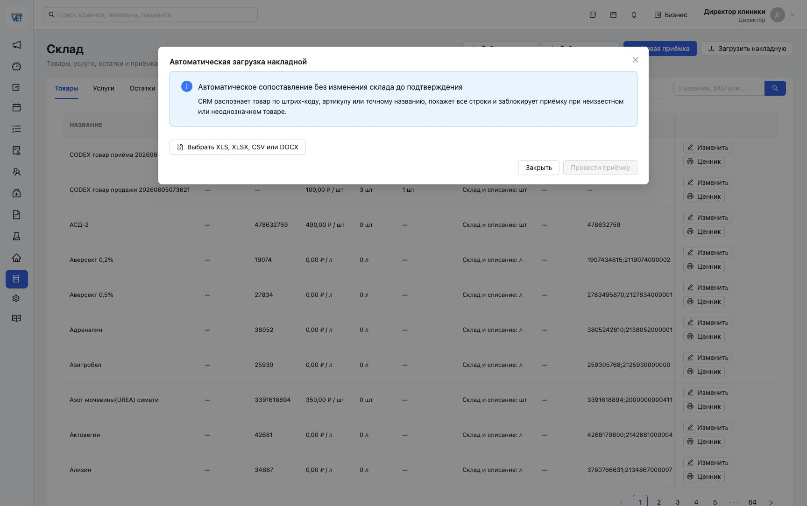
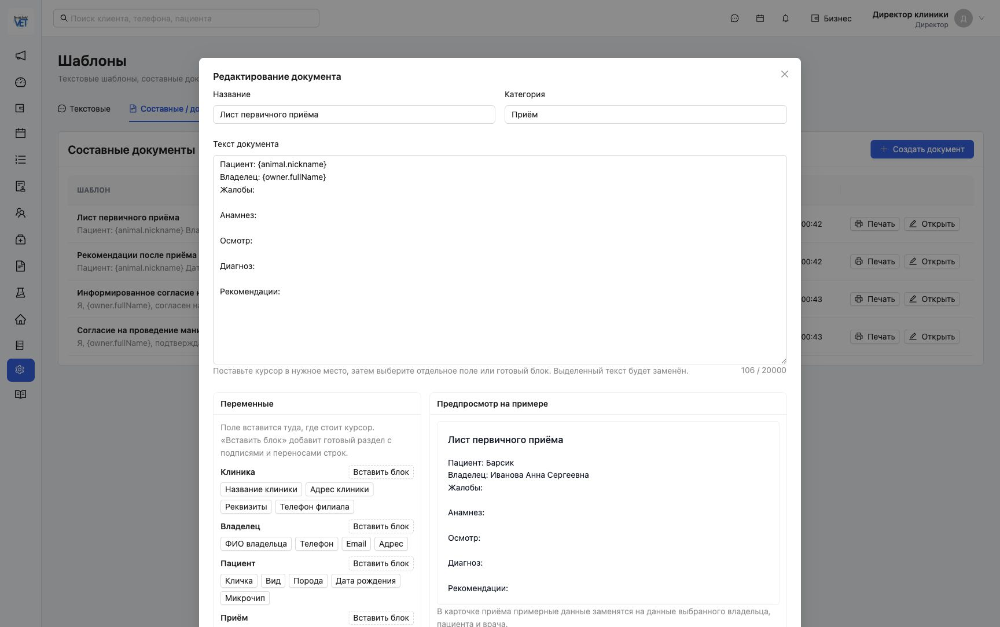
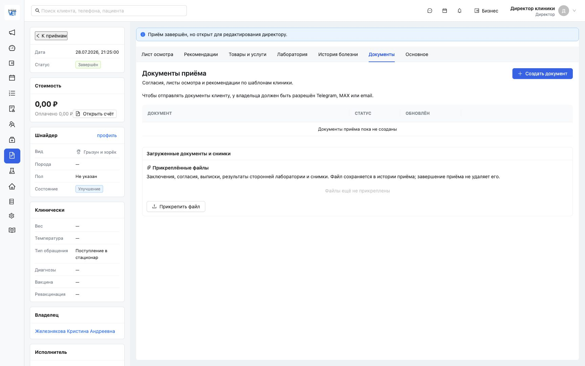

# Повторный продуктовый аудит TemichevVet CRM

Дата: 30 июля 2026 года
Вчерашний срез: `84a6f69041f1d390c3f5227da5fb0a9d27ed173d`
Текущий установленный срез: `2a58dc9e2ef2deb7ece2014f90205a8317809c28`

## 1. Короткий вывод

TemichevVet заметно улучшился именно в тех областях, которые вчера сильнее всего уступали Vet.AF: лабораторные загрузчики, входящие накладные, медицинские файлы и составление документов.

По той же взвешенной модели оценка TemichevVet выросла с **80% до 84%**. Вчерашняя сравнительная оценка Vet.AF остаётся **90% ± 5%** и сегодня заново не пересчитывалась. Условный функциональный разрыв сократился с 10 до 6 процентных пунктов.

При этом продукт нельзя честно оценить в 86%, которые прогнозировались после полного закрытия товарного и документального контуров. Причины:

- старые штрих-коды `код1;код2` не очищены в основном поле товара и конфликтуют с новой отдельной моделью штрих-кодов;
- импортированный каталог по-прежнему содержит пустые категории, нулевые цены и препараты в литрах;
- редактор документов стал удобнее, но остаётся текстовым, без настоящего WYSIWYG, таблиц и версий;
- новые загрузчики и файлы технически проверены, но в этом аудите не выполнялась запись реальных файлов или проведение накладной, чтобы не менять рабочие данные;
- складской контур всё ещё не принят на полном реальном дне клиники.

## 2. Методика и границы

Использована та же модель из десяти продуктовых областей, что и 29 июля. Сопоставлены:

- вчерашний отчёт и его снимки;
- изменения Git между `84a6f69` и `2a58dc9`;
- текущий установленный интерфейс на MacBook;
- текущая Prisma-схема и миграция;
- API health, типизация, тесты и браузерный журнал;
- внешний HTTPS личного кабинета, manifest и service worker.

Аудит был безопасным: не перезапускались контейнеры, не менялись Docker volumes, не проводилась накладная, не загружались файлы, не менялись клинические записи, TECNO и флешка не затрагивались.

## 3. Оценка по областям

| Область | Вес | 29.07 | 30.07 | Изменение | Обоснование |
| --- | ---: | ---: | ---: | ---: | --- |
| Клиническое ядро приёма | 15% | 90% | 90% | 0 | Основной сценарий не менялся; карточка приёма и отдельная кнопка открытия работают |
| Владельцы, пациенты, расписание, очередь | 10% | 88% | 88% | 0 | Новых изменений в этом релизе нет |
| Стационар и лаборатория | 10% | 84% | 90% | +6 | Появился безопасный импорт лабораторных результатов и файлы заказа; стационар не регрессировал |
| Товары, склад, закупки | 15% | 68% | 76% | +8 | Появились несколько штрих-кодов, поиск по ним, загрузчик накладной и оригиналы документов; каталог остаётся грязным |
| Документы, файлы, шаблоны, печать | 12% | 62% | 78% | +16 | Появились медицинские вложения, приватное хранение, контрольная сумма и вставка готовых блоков в позицию курсора |
| Финансы, кассы, зарплата, отчёты | 13% | 82% | 82% | 0 | Изменений нет; фискальная интеграция и реальный закрытый месяц остаются впереди |
| Сообщения и кабинет владельца | 7% | 76% | 76% | 0 | Код шлюза не менялся; внешний портал, manifest и service worker отвечают 200 |
| Импорт, экспорт и перенос | 6% | 94% | 95% | +1 | К универсальному переносу добавились специализированные безопасные загрузчики |
| Права, аудит, резервирование | 7% | 92% | 93% | +1 | Доступ к файлам проверяется по назначению, загрузка и скачивание попадают в аудит |
| UX, обучение, мобильность | 5% | 78% | 80% | +2 | Появились готовые блоки, подсказки и понятные заблокированные действия до проверки |
| **Взвешенный итог** | **100%** | **80%** | **84%** | **+4 п.п.** | Округлено из расчётного результата 84,25% |

## 4. Что реально сделано после вчерашнего аудита

| Вчерашний пробел | Что появилось сегодня | Статус |
| --- | --- | --- |
| Несколько штрих-кодов хранились одной строкой | Отдельная сущность `ProductBarcode`, основной и дополнительные коды, максимум 20, поиск по любому коду | **Частично закрыто:** старое основное поле не очищено |
| Не было загрузчика накладной | XLS/XLSX/CSV/DOCX, автоматическое сопоставление по штрих-коду, SKU или точному названию, безопасный предпросмотр, блокировка неизвестных и неоднозначных строк | **Технически готово**, реальная приёмка не проведена |
| Не было оригинала накладной | PDF, фото или исходная таблица прикрепляются к накладной и хранятся приватно | **Технически готово**, восстановление из backup не принято |
| Не было медицинских вложений | Файлы в приёме и лабораторном заказе, ограничение 15 МБ, MIME-проверка, SHA-256, права и аудит | **Технически готово**; прямой файл без приёма в общей карточке пациента не реализован |
| Не было загрузчика результатов лаборатории | Безопасный предпросмотр, распознавание колонок, сопоставление только с анализами заказа, блокировка до однозначного результата, сохранение исходного файла | **Технически готово**, внешний лабораторный API отсутствует |
| Переменные добавлялись неудобно и в конец | Вставка в позицию курсора, замена выделения, четыре готовых блока: клиника, владелец, пациент, приём | **Улучшено**, но это ещё не rich text |
| Не было наглядного контроля файлов | Единая панель прикреплённых файлов с размером, сотрудником, датой, скачиванием и удалением по правам | **Готово на уровне интерфейса и API** |

Изменение масштаба реализации:

| Показатель | 29.07 | 30.07 |
| --- | ---: | ---: |
| Автоматические сценарии | 91 | 96 |
| HTTP endpoint | 233 | 244 |
| Модели основной Prisma-схемы | 89 | 90 |
| Изменённых файлов релиза | — | 33 |
| Добавлено строк | — | 2 431 |

## 5. Что стало заметно лучше для сотрудника

1. Лаборант или врач сначала видит понятное объяснение безопасной проверки, а кнопка внесения результатов заблокирована до полного распознавания.
2. Администратор может начать загрузку накладной из одного заметного действия в складе, без ручного сопоставления в обычном сценарии.
3. Врач может хранить заключения, согласия, выписки, снимки и сторонние результаты прямо в завершённом приёме.
4. Директор может искать товар по любому отдельному штрих-коду, а не только по одному полю.
5. Шаблон документа теперь можно собирать смысловыми блоками, не разыскивая технические имена переменных.
6. В интерфейсе явно объясняется, что данные не будут внесены до подтверждения.

## 6. Что не ухудшилось

Проверено, что после нового релиза сохраняются ранее исправленные сценарии:

- в стационаре по умолчанию выбран вариант «Все статусы», поиск не требует обязательного статуса;
- приём и пребывание в стационаре остаются разными жизненными циклами;
- температура стационара передаётся с точностью до десятых;
- в списке приёмов остаётся отдельная кнопка «Открыть»;
- инструкция остаётся отдельным пунктом слева под настройками;
- технический порядок способов оплаты скрыт от сотрудников;
- врач по умолчанию сохраняет право создавать и редактировать клиентов.

## 7. Подтверждённые проблемы и риски

### P0. Старые объединённые штрих-коды не нормализованы полностью

В карточке импортированного товара «Аверсект 0,2%» основное поле по-прежнему содержит `1907434815;2119074000002`, а второй код одновременно показан в новом поле дополнительных штрих-кодов. При этом текущая валидация основного поля требует только цифры.

Последствия:

- сотрудник видит один и тот же код в двух представлениях;
- основной графический штрих-код для старой карточки остаётся неоднозначным;
- редактирование старого товара может потребовать ручной очистки поля перед сохранением;
- новый справочник штрих-кодов не решает качество уже импортированного каталога автоматически.

Нужно отдельное безопасное исправление: выбрать первый нормализованный код основным, очистить старое поле от разделителей, сохранить остальные коды отдельно и сформировать отчёт конфликтов без удаления товаров.

### P0. Каталог всё ещё не принят

На текущем экране по-прежнему видны:

- пустые категории;
- цены `0,00 ₽`;
- инъекционные препараты в литрах;
- нулевые остатки;
- широкая таблица с высокой плотностью данных.

Новая модель учёта стала лучше, но качество исходных данных не улучшилось само по себе.

### P0. Новые загрузчики не прошли реальную операционную приёмку

Автоматические тесты и UI подтверждают защитные состояния, но в этом аудите намеренно не загружался реальный файл и не проводилась накладная. До клинической приёмки нужен изолированный сценарий:

1. загрузить тестовую накладную;
2. проверить неизвестный и неоднозначный товар;
3. провести корректную приёмку;
4. проверить партии, срок, цену, остаток и оригинал файла;
5. откатить тестовые данные в изолированной базе;
6. восстановить MinIO-вложение из резервной копии.

### P1. Редактор документов пока не уровня Vet.AF

Добавление блоков и вставка по курсору — важное улучшение, но поле остаётся обычным текстовым редактором. Пока нет:

- таблиц и визуального форматирования;
- заголовков, списков и управляемых разрывов страницы;
- версии шаблона, закреплённой за уже созданным документом;
- отдельного события подписи владельца или сотрудника;
- визуальной сетки A4 до открытия системной печати.

### P1. Вложения пока привязаны к рабочим сущностям, а не напрямую к пациенту

Модель файла поддерживает приём, документ приёма, лабораторный заказ, позицию анализа и накладную. Отдельной прямой связи `patientId` нет. Для обычной работы через историю приёма этого достаточно, но для массовой загрузки старого медицинского архива нужен отдельный сценарий.

### P1. Доступность и плотность

- складская таблица остаётся слишком широкой;
- боковая навигация в свёрнутом виде сильно зависит от иконок и подсказок;
- не проводилась полная клавиатурная проверка и проверка скринридером;
- соответствие WCAG не заявляется.

### Безопасность зависимостей

`npm audit` показывает 0 critical и 2 high для `react-router`/`react-router-dom`. Рекомендация относится к RSC-режиму, а текущий web использует `createBrowserRouter` и не использует RSC API. Это снижает практическую экспозицию, но зависимость нужно обновить целево после совместимого исправления. `npm audit fix --force` запускать нельзя.

## 8. Техническая проверка текущего среза

| Проверка | Результат |
| --- | --- |
| Установленный commit | `2a58dc9e2ef2deb7ece2014f90205a8317809c28` |
| API health | `status=ok`, `database=ok` |
| Web typecheck | PASS |
| Prisma validate | PASS |
| Unit/contract tests | **96/96 PASS** |
| Ошибки браузерной консоли в проверенном маршруте | 0 |
| Личный кабинет `/portal` | HTTP 200 |
| Manifest личного кабинета | HTTP 200 |
| Service worker личного кабинета | HTTP 200 |

## 9. Продуктовое решение

### Что можно считать достигнутым

- TemichevVet больше не имеет нулевого функционала в медицинских вложениях и лабораторных загрузках.
- Склад получил понятный автоматический вход через накладную.
- Документальный редактор стал заметно удобнее для обычного сотрудника.
- Функциональный разрыв с вчерашним ориентиром Vet.AF сократился примерно на 40%: с 10 до 6 процентных пунктов.

### Что пока нельзя считать достигнутым

- Полная нормализация каталога.
- Полностью готовые несколько штрих-кодов на старых товарах.
- Rich text и версионирование документов.
- Реальная приёмка склада, файлов и восстановления на TECNO.
- Внешняя лабораторная интеграция.
- Массовая коммерческая версия без контролируемого внедрения.

Итоговый статус: **сильный кандидат для контролируемой эксплуатации одной клиники, но не финальный массовый коммерческий `1.0`**.

## 10. Следующий приоритет

1. Исправить нормализацию старых штрих-кодов без удаления и перезаписи товаров.
2. Сделать мастер качества каталога: категории, цены, единицы, штрих-коды, дубли.
3. Провести изолированный E2E накладной и лабораторного файла с реальными образцами.
4. Проверить резервное копирование и восстановление новых MinIO-вложений на тестовой копии TECNO.
5. Добавить настоящий редактор A4 с таблицами, форматированием, разрывами страниц и версиями.
6. Только после этого повторно оценивать готовность к 86% и выше.

## 11. Экранные доказательства

### Шаг 1. Текущая сводка и навигация

Общее состояние: стабильный директорский экран; инструкция остаётся слева, основные блоки не регрессировали.

### Шаг 2. Лабораторный загрузчик и файлы

Общее состояние: сильное улучшение; запись заблокирована до однозначного сопоставления.

### Шаг 3. Редактор товара

Общее состояние: новое поле дополнительных штрих-кодов есть, но старое объединённое значение осталось в основном поле.

### Шаг 4. Загрузчик накладной

Общее состояние: понятный автоматический сценарий с безопасным предпросмотром; реальное проведение в аудите не выполнялось.

### Шаг 5. Редактор документа

Общее состояние: вставка готовых блоков и полей стала понятной; полноценного rich text пока нет.

### Шаг 6. Медицинские вложения в приёме

Общее состояние: рабочая точка загрузки появилась и сохраняет файл в истории завершённого приёма.

## 12. Ограничения вывода

- Vet.AF сегодня заново не проверялся внутри защищённого кабинета; его 90% взяты из вчерашнего аудита.
- Не выполнялась запись тестовых файлов в текущую базу.
- Не проводилась реальная накладная.
- Не выполнялось обновление или восстановление на TECNO.
- Не менялись сервер, Docker volumes, клинические данные и флешка.
- Не проводилась юридическая оценка фискализации, электронной подписи и 152-ФЗ.
