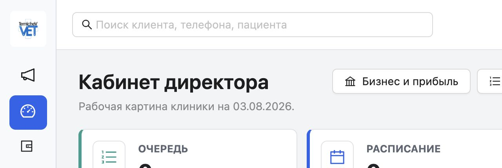
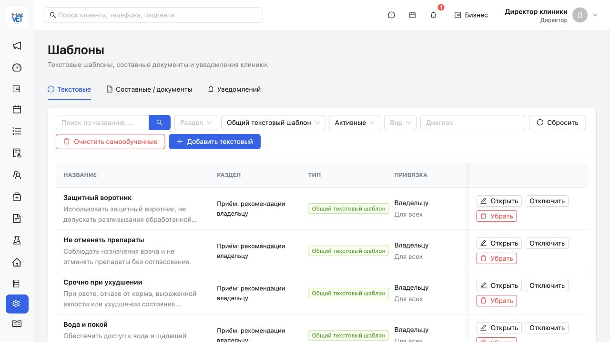
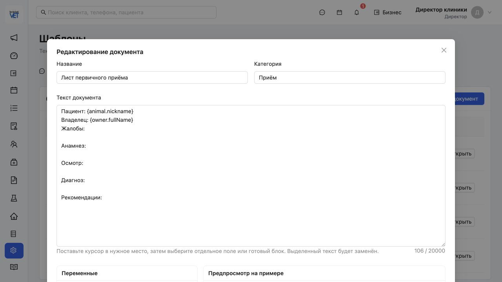
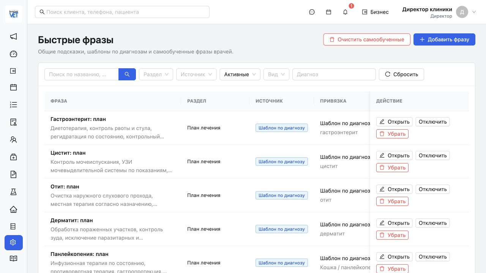
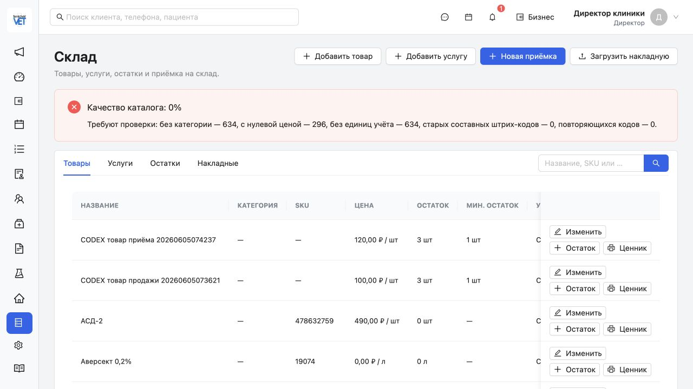
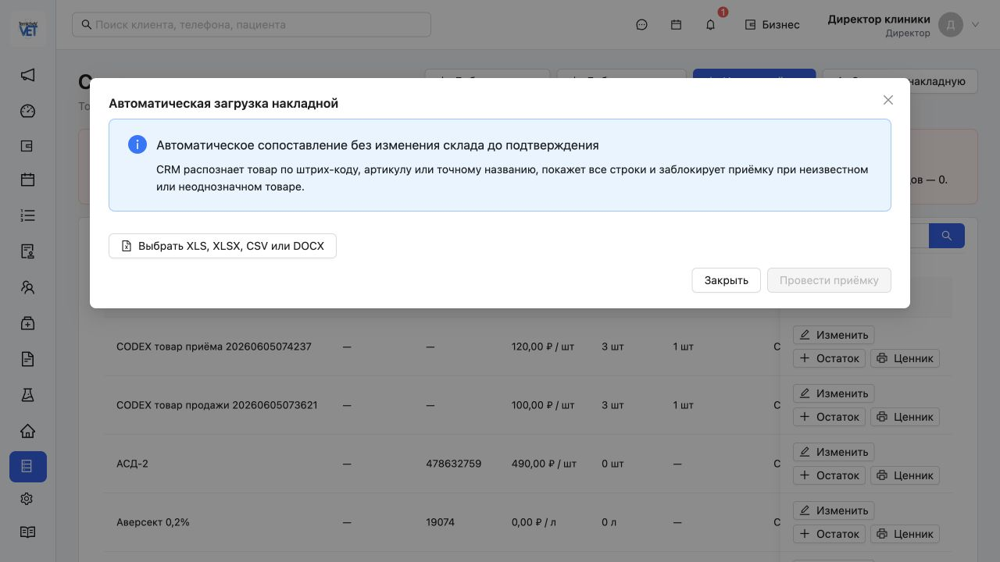

# Полный продуктовый аудит TemichevVet CRM

Дата аудита: 3 августа 2026 года
Проверенный срез: `efc6c95` (`origin/main` и текущий `HEAD`)
Тип аудита: продуктовый, функциональный, UX, архитектурный и технический
Граница безопасности: без изменения клинических записей, Docker volumes, рабочего сервера, TECNO и флешки

## 1. Короткий вывод для принятия решений

TemichevVet уже является не прототипом, а большой рабочей CRM для одной клиники. В текущем коде есть 93 модели данных, 36 API-контроллеров, 266 HTTP endpoint, 66 frontend-маршрутов и 123 автоматических сценария. Клиническое ядро, очередь, расписание, владельцы, пациенты, приёмы, счета, продажи, складские документы, лаборатория, стационар, зарплата, отчёты, аудит, импорт, резервирование, личный кабинет и защищённый шлюз существуют в реальном коде.

Главная проблема продукта теперь не в отсутствии разделов. Главная проблема — **неравномерная глубина**:

- клиническое ядро и безопасный перенос данных уже сильные;
- документы, шаблоны и медицинский архив заметно проще зрелых конкурентов;
- стационар пока является журналом отдельных событий, а не полноценным многосуточным листом лечения;
- складской механизм развит, но реальный каталог не приведён в рабочее состояние;
- кабинет владельца и заявки уже есть, но публичный сайт, стабильная коммуникация и эксплуатационная приёмка ещё не завершены;
- «маленький помощник, запоминающий фразы» не исчез: его ядро реализовано, но оно спрятано и не оформлено как законченный продуктовый сценарий;
- ряд обещаний дорожной карты уже выполнен, но сама дорожная карта устарела и не отделяет готовый код от принятого в клинике результата.

Моя текущая управленческая оценка:

- функциональная широта TemichevVet относительно Vet.AF: **85–86%**;
- готовность для контролируемой работы одной клиники: **88–91%**;
- готовность к массовому коммерческому тиражированию без сопровождения: **78–82%**;
- состояние документов и шаблонов как самостоятельного контура: **около 70–74%**;
- состояние стационарного листа в требуемом врачом виде: **около 55–60%**.

Это продуктовая оценка, а не математически доказанная метрика. Она основана на текущем коде, локальном интерфейсе, тестах, предыдущем исследовании защищённого кабинета Vet.AF и актуальных публичных материалах Vet.AF.

> Термин «VTF» в задаче трактуется как Vet.AF, потому что именно Vet.AF указан конкурентом в дорожной карте и сравнительных документах проекта. Если имелся в виду другой продукт, для него нужен отдельный сравнительный проход.

## 2. Что проверено

Проверены:

1. Текущий `HEAD` и соответствие `origin/main`.
2. Историческая дорожная карта `docs/TEMICHEVVET_ROADMAP.md`.
3. Аудиты 26, 29 и 30 июля 2026 года.
4. Исследование Vet.AF и сравнительные таблицы проекта.
5. Текущая Prisma-схема, миграции, API-модули и frontend-маршруты.
6. Документы, шаблоны, файлы, печать и статусы документов.
7. Механизм быстрых и самообученных медицинских фраз.
8. Стационар, записи журнала, редактирование и связь со счётом/складом.
9. Склад, накладные, загрузчики и реальное качество каталога.
10. Кабинет владельца, заявки, Telegram/MAX и проект будущего сайта.
11. Отчёты, финансы, зарплата, права, аудит и резервирование.
12. Производственная frontend-сборка, типизация, Prisma validate и автоматические тесты.
13. Актуальные публичные материалы Vet.AF: [описание возможностей](https://vetaf.ru/about), [сравнение систем](https://vetaf.ru/comparison) и [тарифы](https://vetaf.ru/prices).

Не выполнялись:

- проведение реальной накладной;
- загрузка реальных медицинских или лабораторных файлов;
- изменение записей стационара;
- отправка реальных сообщений владельцам;
- изменение настроек рабочего шлюза;
- перезапуск контейнеров или проверка рабочего TECNO;
- проверка закрытого кабинета Vet.AF в текущий день.

Поэтому в отчёте различаются четыре уровня доказательств:

- **реализовано в коде**;
- **прошло локальные автоматические проверки**;
- **видно в текущем локальном интерфейсе**;
- **принято на рабочем устройстве/в реальной смене**.

Последний уровень нельзя подменять первыми тремя.

## 3. Текущий масштаб продукта

| Показатель | Текущее значение | Что означает |
| --- | ---: | --- |
| Prisma-модели | 93 | Широкая предметная модель, включая клинику, финансы, склад, файлы, кабинет и поддержку |
| Prisma-enum | 42 | Формализованные статусы и типы основных процессов |
| Миграции | 43 | Продукт прошёл много последовательных этапов расширения |
| API-контроллеры | 36 | Модули разделены по предметным областям |
| HTTP endpoint | 266 | Большой прикладной API, не демонстрационная оболочка |
| Frontend-маршруты | 66 | Почти все ежедневные и директорские функции имеют отдельные экраны |
| Автоматические сценарии | 123 | Хорошая защита договорённостей и миграционных ограничений |
| Файлы тестов | 21 | Покрытие есть, но распределено неравномерно |
| Основной JS-файл | 2 666,69 КБ | Нужна ленивая загрузка маршрутов, но это не первый продуктовый приоритет |

## 4. Сводная оценка по продуктовым областям

| Область | Оценка | Состояние | Главный остаточный разрыв |
| --- | ---: | --- | --- |
| Владельцы и пациенты | 92% | Сильное | Нет полноценного общего медицинского файлового архива пациента |
| Расписание и очередь | 91% | Сильное | Публичная запись требует эксплуатационной приёмки и сайта |
| Приём и история болезни | 91% | Сильное | Медицинские тексты без rich text и полноценного помощника |
| Стационар | 60% | Частичное | Нет многосуточного листа, графиков, печати и календарного ограничения правки |
| Лаборатория | 84% | Рабочее ядро | Нет внешней интеграции и зрелой библиотеки профилей уровня Vet.AF |
| Счета, оплаты, продажи | 88% | Сильное | Нет принятого фискального/кассового контура |
| Склад и накладные | 78% | Механизм есть, данные не готовы | Каталог 0% качества: категории, цены, единицы |
| Документы, файлы, шаблоны | 72% | Главный конкурентный разрыв | Нет WYSIWYG, версий, прямого архива пациента и реальной подписи |
| Отчёты и управление | 85% | Хорошее | Меньше готовых разрезов и зрелости, чем у Vet.AF |
| Зарплата | 82% | Рабочее | Меньше методов и меньше принятого закрытого периода |
| Сообщения и кабинет | 84% | Реализовано частично | Telegram-вход подтверждён на рабочем MacBook; остаются TECNO, сайт и общий входящий центр |
| Импорт и перенос | 95% | Одна из сильнейших областей | Нужна приёмка больших реальных архивов и файлов |
| Права, аудит, автономность | 93% | Сильное | Нет 2FA для директора/администратора и зрелого device management |
| Обучение и UX | 82% | Хорошая база | Некоторые сильные функции спрятаны, плотные экраны не везде доведены |

## 5. Что в CRM уже действительно есть

### 5.1. Клиническое ядро

Реализованы:

- владельцы, доверенные лица, контакты и каналы связи;
- пациенты, виды, породы, пол, дата рождения, идентификаторы и вакцинации;
- глобальный поиск владельца, телефона и пациента;
- расписание, смены, кабинеты и записи;
- электронная очередь и отдельный экран для ожидания;
- приём с осмотром, анамнезом, симптомами, температурой, весом, диагнозами, манипуляциями и рекомендациями;
- история болезни внутри рабочего места врача;
- товары и услуги приёма;
- счета, оплаты, долг, депозит, продажи и списание со склада;
- документы приёма и медицинские вложения;
- лабораторные заказы и результаты;
- госпитализация из приёма;
- аудит действий.

Это уже достаточная основа для реальной ежедневной работы клиники. По широте карточки врача TemichevVet приблизился к Vet.AF.

### 5.2. Финансы и управление

Реализованы:

- счета с несколькими источниками;
- оплаты, частичные оплаты и долг;
- способы оплаты и кассы;
- депозиты владельцев;
- движение денег отдельно от управленческого результата;
- ежедневное закрытие;
- управленческий отчёт;
- Excel и PDF-выгрузки;
- начисление зарплаты с правилами по услугам и товарам;
- корректировки, утверждение периода и журнал действий;
- бизнес-раздел директора.

Это больше, чем было заявлено в ранней дорожной карте. Фраза «расчёт зарплаты позже» уже устарела: контур реализован.

### 5.3. Склад

Реализованы:

- товары, услуги, категории и единицы;
- отдельные складские и расчётные единицы;
- несколько штрих-кодов товара;
- внутренний EAN-13;
- партии, остатки, срок годности и минимальный остаток;
- складские движения;
- ручная приёмка;
- накладные, поставщики, несколько строк и корректировки;
- инвентаризация и возврат поставщику;
- печать ценников;
- автоматическая загрузка XLS, XLSX, CSV и DOCX;
- сопоставление по штрих-коду, артикулу или точному названию;
- блокировка проведения при неизвестной или неоднозначной позиции;
- хранение оригинала накладной;
- отчёт качества каталога.

Механизм склада уже существенно сильнее своей репутации в старых обсуждениях. Но качество данных делает его частично непригодным: текущий интерфейс показывает **0% качества каталога**, 634 позиции без категории, 296 с нулевой ценой и 634 без заполненных единиц учёта. Старых составных и повторяющихся штрих-кодов сейчас по отчёту нет, то есть именно эта старая проблема, вероятно, закрыта.

### 5.4. Лаборатория

Реализованы:

- лабораторные профили;
- заказы и отдельные исследования;
- статусы и результаты;
- файлы заказа и результата;
- автоматическая загрузка табличных результатов;
- предпросмотр и блокировка неоднозначных строк;
- уведомления о готовности;
- отображение в приёме и кабинете владельца.

Не реализована зрелая внешняя интеграция уровня VetUnion или других лабораторий. По текущим приоритетам владельца продукта её разумно оставить в длинном бэклоге.

### 5.5. Кабинет владельца и внешняя коммуникация

Реализованы:

- отдельный публичный owner-gateway со своей базой;
- одноразовые приглашения;
- вход в браузере, Telegram и MAX;
- HttpOnly-сессия кабинета;
- пациенты, приёмы, документы, счета, уведомления и заявки;
- Web Push;
- заявка на запись без автоматического создания приёма;
- исходящее получение заявок локальной CRM;
- дедупликация по `externalRequestId`;
- действия администратора: подтвердить, редактировать, связаться с клиентом;
- персональные сообщения и очередь отправки;
- предварительная проверка аудитории рассылки;
- безопасная граница: шлюз не получает прямой доступ к клинической PostgreSQL.

Не завершены:

- публичный сайт/подсайт клиники как понятная точка входа;
- публичная форма для нового владельца;
- стабильная эксплуатационная приёмка Telegram/MAX на разных устройствах: вход через Telegram подтверждён владельцем продукта на рабочем MacBook 3 августа 2026 года, TECNO ещё не проверен;
- единый входящий центр сообщений из кабинета, сайта и мессенджеров;
- продуктовая аналитика пути «сайт → заявка → подтверждение → визит»;
- окончательные тексты согласия и политика обработки персональных данных.

## 6. Дорожная карта: что выполнено, что частично и что забыто

### 6.1. Выполнено или выполнено сверх старого плана

1. Основной Vet.AF-подобный рабочий интерфейс.
2. Очередь, расписание, владельцы, пациенты и приёмы.
3. Счета, оплаты, продажи, склад и списание.
4. Лаборатория и загрузчик результатов.
5. Базовый стационар и связь со счётом/складом.
6. Документы приёма, переменные, печать и отправка в очередь уведомлений.
7. Сотрудники, роли, права и аудит.
8. Отчёты и управленческий экран.
9. Зарплата, хотя в дороге она ещё обозначена как будущая.
10. Безопасный перенос из Vet.AF с предпросмотром, дедупликацией и откатом.
11. Локальная автономная работа и переносные комплекты.
12. Удалённый доступ через ограниченный шлюз.
13. Личный кабинет владельца и заявки.
14. Медицинские и складские файлы в приватном хранилище.
15. Быстрые и самообученные фразы врача.

### 6.2. Частично выполнено

| Идея дорожной карты | Что есть | Чего не хватает |
| --- | --- | --- |
| Полноценный стационар | Пребывание, бокс, события, температура, товары/услуги | План назначений, многосуточный лист, графики, пропуски, печать, закрытие дня |
| Документы и шаблоны | Текст, переменные, статусы, печать, файлы | Rich text, таблицы, версии, A4-макет, подпись, прямой архив пациента |
| Онлайн-запись | Заявка из кабинета и действия администратора | Сайт, публичный вход нового владельца, аналитика, SLA обработки |
| Сообщения | Исходящая очередь, Telegram/MAX/email-контур | Единая входящая переписка, стабильная двусторонняя эксплуатация |
| Личный кабинет | Пациенты, история, документы, заявки | Законченный onboarding, диагностика каналов, публичный маркетинговый вход |
| Помощник | Локальная память фраз | Отдельный врачебный сценарий, качество рекомендаций, принятие/отклонение, сборка черновика |
| Отчёты | Базовые управленческие и экспорт | Более широкий библиотечный набор, конструктор и доказанная месячная приёмка |
| Зарплата | Правила и периоды | Богатство методов уровня Vet.AF и принятие реального закрытого месяца |

### 6.3. Не реализовано или осталось идеей

1. Полноценный «ассистент-секретарь» для входящих сообщений и звонков.
2. Единая очередь входящих с сайта, Telegram, MAX и кабинета.
3. Публичный маркетинговый сайт клиники, передающий заявки только в gateway.
4. Полный многосуточный лист стационара.
5. Версионируемые юридически значимые шаблоны документов.
6. Настоящая электронная подпись или формализованное событие подписи.
7. Общий медицинский файловый архив пациента вне конкретного приёма.
8. Массовая загрузка старого архива документов и результатов.
9. OCR и извлечение метаданных из сканов.
10. Внешние лаборатории и VetUnion.
11. SMS, полноценная email-инфраструктура и телефония.
12. Фискальная/кассовая интеграция.
13. Двухфакторная аутентификация директора и администратора.
14. Нативные приложения; правильно оставлены на потом, пока PWA достаточно.
15. Мультиклиника, центральный склад и межфилиальные процессы.
16. Продвинутая продуктовая аналитика: удержание, повторные визиты, загрузка врачей, ожидание, воронка сайта.
17. Ленивая загрузка frontend-маршрутов.

## 7. Главный разрыв: документы, загрузки и шаблоны

### 7.1. Что есть сейчас

Текущая модель поддерживает:

- категории шаблонов;
- название, текст и JSON-переменные;
- создание документа в приёме из шаблона;
- сохранённый текст документа;
- статусы `DRAFT`, `GENERATED`, `SIGNED`, `CANCELLED`;
- защиту сформированного и подписанного документа от удаления;
- предпросмотр;
- вставку переменной в позицию курсора;
- готовые текстовые блоки;
- печатную шапку и зоны подписей;
- медицинские вложения;
- лабораторные файлы;
- оригиналы накладных;
- приватное хранение, MIME-проверку, ограничение размера, SHA-256 и аудит.

Это хорошая техническая основа. Но пользовательский редактор остаётся обычным многострочным текстовым полем.

### 7.2. Почему это отставание от Vet.AF

В исследованном интерфейсе Vet.AF медицинские тексты и документы поддерживают форматирование: жирный, курсив, подчёркивание, размер, цитаты, списки, таблицы и загрузку шаблона. Публично Vet.AF также заявляет шаблоны документов и лаборатории с переменными, готовыми к печати.

В TemichevVet сейчас нет:

- визуального A4-листа;
- структуры абзацев и заголовков;
- таблиц;
- разрывов страниц;
- колонтитулов;
- нумерации страниц;
- изображений и печатей внутри документа;
- библиотечных блоков согласий и протоколов;
- версии шаблона;
- истории редакций;
- явного снимка версии и входных данных при формировании;
- неизменяемого PDF-результата;
- модели подписанта, времени, способа и подтверждения подписи;
- прямой папки документов пациента;
- массовой загрузки архивных документов;
- OCR и поиска по содержимому.

Статус `SIGNED` сейчас является статусом, а не доказательством подписи. Нарисованная линия «Подпись владельца» не является электронной подписью.

### 7.3. Целевая модель «Документы 2.0»

Нужны отдельные сущности:

1. `DocumentTemplate` — логическая карточка шаблона.
2. `DocumentTemplateVersion` — неизменяемая версия структуры и печатных настроек.
3. `GeneratedDocument` — неизменяемый снимок текста, данных, версии и PDF.
4. `PatientFile` или прямой `animalId` у файла — медицинский архив пациента.
5. `SignatureEvent` — кто, когда, каким способом и какую контрольную сумму подтвердил.
6. `DocumentDelivery` — кабинет, печать, Telegram, MAX или email и статус доставки.
7. `DocumentAuditEvent` — создание, изменение черновика, формирование, подпись, отмена, скачивание.

Сформированный документ должен хранить:

- ID и номер версии шаблона;
- исходные значения переменных;
- итоговую структуру документа;
- итоговый PDF;
- SHA-256 результата;
- автора и время формирования;
- подписи и контрольные суммы;
- историю доставки.

### 7.4. Как должен выглядеть редактор

Минимальная версия:

- A4-полотно;
- заголовок, обычный текст, жирный/курсив/подчёркивание;
- маркированные и нумерованные списки;
- таблица;
- разрыв страницы;
- выравнивание;
- переменные владельца, пациента, приёма, врача и клиники;
- предпросмотр на реальном пациенте без сохранения документа;
- автосохранение черновика шаблона;
- публикация новой версии отдельной кнопкой;
- сравнение текущей и опубликованной версии;
- серверное создание PDF;
- экспорт DOCX как дополнительный формат, но PDF как фиксированный результат.

### 7.5. Библиотека обязательных форм

Первыми следует сделать:

1. Согласие на обработку данных.
2. Согласие на осмотр и манипуляции.
3. Отказ от предложенной диагностики/лечения.
4. Согласие на анестезию.
5. Согласие на операцию.
6. Протокол анестезии.
7. Протокол операции.
8. Выписка из стационара.
9. Полный лист стационара.
10. Рекомендации и назначения.
11. Направление в лабораторию.
12. Результат исследования.
13. Справка/выписка из истории болезни.
14. Согласие на фото/видео при необходимости.

### 7.6. Критерии приёмки «Документы 2.0»

- старые текстовые шаблоны открываются после миграции без потери текста;
- опубликованную версию нельзя изменить задним числом;
- изменение шаблона создаёт новую версию;
- документ хранит конкретную версию и неизменяемый PDF;
- таблица и разрыв страницы печатаются одинаково в Chrome, Safari и PDF;
- файл можно прикрепить к пациенту без создания фиктивного приёма;
- старый архив можно загрузить пакетно с отчётом ошибок;
- подпись хранит способ, время, подписанта и контрольную сумму;
- владелец видит только разрешённые сформированные документы;
- backup/restore восстанавливает БД и все файлы вместе.

## 8. Стационар: что требуется исправить

### 8.1. Текущее состояние

Сейчас госпитализация имеет:

- отдельное пребывание;
- пациента, владельца, врача, бокс, цель, начало и завершение;
- записи журнала с датой и автором;
- типы температуры, лекарства, процедуры, наблюдения, кормления и ухода;
- связь записи с товаром/услугой, счётом и складом;
- редактирование записи;
- аудит.

Но экран показывает плоский «Журнал стационара». Это набор строк, а не лист лечения.

### 8.2. Критические пробелы

1. Нет одного экрана всего пребывания за несколько суток.
2. Нет разбиения по календарным дням и времени.
3. Нет отдельно назначенного плана и факта выполнения.
4. Нет отметок «выполнено», «пропущено», «отменено», «поздно».
5. Нет графика температуры.
6. Нет веса, воды, корма, мочеиспускания и стула как системных рядов.
7. Нет передачи смены и краткой сводки состояния.
8. Нет печати полного многосуточного листа.
9. Нет правил блокировки редактирования прошедшего дня.
10. Backend сейчас позволяет редактировать старую запись без проверки календарного дня пребывания.

### 8.3. Рекомендуемый пользовательский интерфейс

У одного пребывания должны быть три представления:

1. **Лист стационара** — таблица по дням и времени: назначения, факт, дозировка, исполнитель, комментарий.
2. **Графики** — температура, вес, приём воды/корма, выделения и другие измеряемые показатели.
3. **Журнал и исправления** — неизменяемая хронология действий, правок и дополнений.

Основной экран врача — «Лист стационара», а не журнал.

### 8.4. Правило редактирования

Из слов владельца продукта следует календарное правило: если сегодня второе число, можно редактировать записи второго числа до конца дня. Это не скользящие 24 часа.

Рекомендуемое правило:

- часовой пояс берётся из настроек клиники;
- запись можно свободно редактировать до 23:59:59 того же календарного дня;
- после закрытия дня исходная запись не меняется;
- врач создаёт «исправление» с причиной;
- директор может сделать экстренное исправление с усиленным аудитом;
- после выписки тихое редактирование запрещено;
- исправления попадают в печатную историю отдельной отметкой.

### 8.5. Печать

Печатная форма должна:

- охватывать всё пребывание или выбранные дни;
- печататься A4 landscape;
- группировать назначения по времени;
- показывать план и факт;
- включать график температуры;
- содержать подписи/инициалы исполнителей;
- показывать исправления, но не технические UUID;
- иметь шапку клиники, пациента, владельца, диагноз/цель, время поступления и выписки;
- создавать фиксированный PDF и прикрепляться к истории пациента.

### 8.6. Критерии приёмки

- врач видит всё пребывание без перелистывания отдельных записей;
- температура автоматически строит график;
- назначение и выполнение не смешиваются;
- пропущенная процедура видна визуально;
- редактирование вчерашней записи отклоняется API, а не только скрывается в интерфейсе;
- исправление после закрытия дня сохраняет исходное значение;
- печать за три и более суток помещается на понятный набор страниц;
- PDF повторно открывается из карточки пациента;
- товары и лекарства продолжают корректно списываться со склада.

## 9. Помощник и память фраз

### 9.1. Важный вывод

Желание сделать маленький локальный помощник не было полностью забыто. В текущем коде есть рабочее ядро самообучения.

Система уже:

- учится на семи полях осмотра и рекомендаций;
- разбивает сохранённый текст на фразы;
- хранит личные фразы конкретного врача;
- исключает точные дубли по SHA-хэшу;
- считает частоту использования;
- запоминает время последнего использования;
- ставит личные частые фразы выше общих;
- позволяет системные и диагнозные шаблоны;
- учитывает вид и диагноз для вручную созданных шаблонов;
- даёт директору включать, отключать и очищать самообученные фразы;
- показывает варианты прямо у медицинского текстового поля.

То есть «память фраз» реализована примерно на 55–65% как технический механизм.

### 9.2. Почему она воспринимается как забытая

- нет отдельного понятного продукта «Помощник врача»;
- функция спрятана в настройках и маленьком выпадающем списке;
- первый уникальный фрагмент может сразу стать подсказкой;
- нет кнопок «полезно», «не предлагать», «закрепить»;
- нет экрана личной памяти врача;
- нет объединения похожих формулировок;
- нет нормализации синонимов и склонений;
- самообученная фраза не получает контекст вида/диагноза автоматически;
- нет объяснения, почему предложена фраза;
- нет сборки нескольких фраз в связный черновик;
- нет целевых тестов качества ранжирования и самообучения;
- старый prototype-маршрут по-прежнему содержит заглушку AI-помощника, а реальный React-маршрут `/assistant` отсутствует;
- README говорит о будущем AI-модуле, поэтому документация расходится с фактическим промежуточным механизмом.

### 9.3. Рекомендуемый «Помощник 1.0» без внешнего AI

Сначала не нужен большой языковой сервис. Нужен законченный локальный продукт поверх существующего ядра:

1. Подсказка появляется после 2–3 подтверждённых повторений, а не после первого сохранения.
2. Врач может принять, отклонить, закрепить и отредактировать подсказку.
3. Похожие фразы объединяются в одну карточку.
4. Учитываются поле, врач, вид, диагноз и последние выбранные формулировки.
5. Видно объяснение: «Вы использовали эту фразу 8 раз при кошках с…».
6. Личная память врача доступна только ему; директор видит управление и статистику, но не должен бесконтрольно переиспользовать индивидуальные тексты.
7. Помощник предлагает, но никогда не сохраняет медицинский текст автоматически.
8. Любая вставка остаётся редактируемой и подтверждается врачом.
9. Есть компактная команда «Собрать черновик» из выбранных блоков.
10. Есть отдельный экран качества: новые, подтверждённые, скрытые, дубли.

### 9.4. «Помощник 2.0» с локальной моделью

После измерения пользы памяти фраз можно добавить маленькую локальную модель на сервере клиники:

- краткая сводка истории для врача;
- сборка черновика осмотра из выбранных фактов;
- сжатие длинных заметок без изменения медицинского смысла;
- поиск противоречий и незаполненных обязательных полей;
- подготовка понятных владельцу рекомендаций из утверждённого врачом плана.

Ограничения должны быть жёсткими:

- не ставить диагноз;
- не назначать лечение самостоятельно;
- не отправлять сообщения без подтверждения;
- не изменять медицинскую карту без врача;
- не передавать данные пациента внешнему AI без отдельного юридического и архитектурного решения;
- хранить исходный текст и итоговый подтверждённый вариант;
- показывать врачу, что именно сгенерировано.

### 9.5. Метрики помощника

- доля медицинских записей, где использована подсказка;
- количество принятых и отклонённых подсказок;
- среднее время заполнения осмотра;
- доля исправленного текста после вставки;
- число дубликатов;
- число скрытых врачом предложений;
- ошибки контекста и жалобы врача.

## 10. Сравнение с Vet.AF

Актуальная публичная страница Vet.AF заявляет более 20 отчётов, 13 методов расчёта зарплаты, внутреннюю лабораторию, центр уведомлений, шаблоны документов, VetUnion и кабинет владельца с записью и чатом. Публичная сравнительная страница также указывает онлайн-запись, электронную очередь, мобильную работу, лабораторию, внутренний чат и Telegram-бот. Это маркетинговые заявления конкурента, а не независимая сертификация каждого сценария.

### 10.1. Где Vet.AF сильнее

1. **Документы и rich text.** Более зрелый редактор, загрузки и шаблоны.
2. **Лабораторная экосистема.** Готовые исследования и внешняя интеграция.
3. **Стационарные уведомления.** Более зрелое событийное сопровождение процедур.
4. **Отчётность.** Более широкая готовая библиотека.
5. **Зарплата.** 13 заявленных методов.
6. **Коммуникации.** Дольше эксплуатируемые чат, кабинет и мессенджеры.
7. **SaaS-зрелость.** Регистрация, тарифы, хранение, поддержка многих организаций.
8. **Мобильность.** Публично заявлена работа через смартфоны и приложения.

### 10.2. Где TemichevVet уже сильнее или потенциально сильнее

1. **Локальная автономность.** Клиника продолжает работать без интернета.
2. **Владение данными.** Основная медицинская база остаётся у клиники.
3. **Безопасный публичный контур.** Gateway отделён от клинической базы.
4. **Контролируемый импорт.** Предпросмотр, строгая валидация, дедупликация и откат.
5. **Разделение оплаты и списания.** Количество для клиента не смешивается со складским объёмом.
6. **Прозрачная дневная экономика.** Управленческий результат отделён от движения денег.
7. **Гибкость.** Продукт можно быстро адаптировать под фактическую работу клиники.
8. **Переносимость.** Есть продуманные Mac/Windows/flash-сценарии с проверками и откатом.
9. **Ограничение внешнего риска.** CRM не открывает клинический API сайту напрямую.

### 10.3. Правильная стратегия конкуренции

Не нужно копировать Vet.AF целиком. Побеждать следует в четырёх направлениях:

1. Лучший врачебный сценарий: приём, стационар, история и помощник.
2. Лучшие документы: быстрые шаблоны, версии, PDF и архив пациента.
3. Локальная надёжность и владение данными.
4. Простой кабинет владельца и сайт без раскрытия клинической сети.

## 11. UX-аудит ключевых экранов

### Шаг 1. Сводка директора

**Общее состояние: хорошее.** Навигация плотная и понятная, основные модули доступны слева, верхняя панель содержит быстрые рабочие действия. Интерфейс визуально ближе к зрелой CRM, чем к демонстрационному dashboard.

### Шаг 2. Центр шаблонов

**Общее состояние: функциональное, но перегруженное.** В одном разделе соединены документы, текстовые шаблоны и уведомления. Это мощно, но врачу и директору трудно понять иерархию. Самообучение видно как техническая кнопка очистки, а не как помощник.

### Шаг 3. Редактор документа

**Общее состояние: частичное.** Переменные и предпросмотр сделаны разумно, но главное поле остаётся обычным `textarea`. Для согласий, выписок, таблиц и стационарных листов этого недостаточно.

### Шаг 4. Быстрые фразы

**Общее состояние: полезное ядро, слабая подача.** В системе действительно есть общие, диагнозные и самообученные фразы, но нет ощущения отдельного помощника и нет понятного управления личной памятью врача.

### Шаг 5. Склад и качество каталога

**Общее состояние: критический блокер данных.** Сам экран удобный, действия понятны, старые проблемы штрих-кодов по счётчикам устранены. Но при качестве 0% нельзя считать склад полностью принятым.

### Шаг 6. Загрузка накладной

**Общее состояние: хорошая продуктовая безопасность.** Интерфейс честно объясняет, что склад не изменяется до подтверждения, а неизвестные и неоднозначные позиции блокируют приёмку. Это правильный обычный сценарий без технического сопоставления на первом экране.

### Шаг 7. Стационар

**Общее состояние: незавершённый основной сценарий.** В коде и интерфейсе есть временной журнал и редактирование, но нет требуемого многосуточного листа. Скриншот с текущими данными не включён в отчёт, чтобы не переносить персональные и медицинские сведения.

### Шаг 8. Кабинет владельца и заявки

**Общее состояние: рабочая архитектура, требующая эксплуатационной приёмки.** Заявка не превращается в запись без администратора, есть подтверждение, редактирование и связь с клиентом. Нужны стабильные каналы и понятный сайт-вход.

## 12. Техническое состояние

### 12.1. Что прошло

- `npm run test:unit`: 123 из 123 тестов прошли;
- `npm run web:typecheck`: без ошибок;
- Prisma validate: схема валидна;
- `npm run web:build`: production-сборка успешна;
- API и owner-gateway собираются в составе тестовой команды.

### 12.2. Ограничение тестов

Многие тесты являются сильными контрактными проверками кода, миграций и интерфейсных договорённостей. Это полезно, но не заменяет:

- браузерный E2E реальной смены;
- проверку на рабочем TECNO;
- восстановление БД и MinIO;
- печать на реальном принтере;
- работу на iPhone/Android;
- устойчивость Telegram/MAX/webhook;
- проверку больших файлов и большого числа записей;
- целевые тесты алгоритма самообученных фраз.

### 12.3. Frontend-производительность

Сборка показывает:

- основной JS: 2 666,69 КБ, gzip 769,92 КБ;
- XLSX-часть: 499,55 КБ;
- все рабочие страницы импортируются статически;
- Vite предупреждает о чанке больше 500 КБ.

Что это означает для пользователя: браузер при первом входе загружает код почти всей CRM, даже если сотрудник открывает только очередь или расписание. На быстром компьютере в локальной сети это терпимо, на старом компьютере и телефоне ухудшает первый запуск и обновление.

Решение:

- `React.lazy`/dynamic import для крупных маршрутов;
- отдельные чанки документов, отчётов, склада, лаборатории, импорта и XLSX;
- предварительная загрузка только ближайшего вероятного маршрута;
- измерение Web Vitals до и после;
- контроль размера в CI.

Приоритет: **P2 после стационара, документов и нормализации каталога**, если нет доказанного критического торможения на рабочих устройствах.

## 13. Риски

| Риск | Вероятность | Влияние | Действие |
| --- | --- | --- | --- |
| Неполный стационар приводит к бумажному обходу CRM | Высокая | Высокое | P0: лист, графики, печать, правила редактирования |
| Документы нельзя считать юридически фиксированными | Высокая | Высокое | Версии, PDF-снимок, SignatureEvent и контрольная сумма |
| Грязный каталог ломает стоимость и списание | Высокая | Высокое | Мастер качества и ручная приёмка 634 позиций |
| Вложения не восстановятся вместе с БД | Средняя | Высокое | Изолированный backup/restore PostgreSQL + MinIO |
| Подключение Telegram/MAX может различаться между устройствами | Средняя | Высокое | Telegram-вход подтверждён на рабочем MacBook; проверить TECNO и полный сценарий нового владельца по матрице устройств |
| Помощник предлагает мусор после первого сохранения | Средняя | Среднее | Порог повторов, подтверждение и отрицательная обратная связь |
| Старые шаблоны повредятся при переходе на rich text | Средняя | Высокое | Односторонняя миграция, предпросмотр, откат и тестовый набор |
| Изменение старой стационарной записи скрывает историю | Высокая | Высокое | Календарный lock и amendment вместо перезаписи |
| Права директора без 2FA | Средняя | Высокое | TOTP и подтверждение чувствительных действий |
| Большой frontend замедляет мобильный первый вход | Средняя | Среднее | Ленивая загрузка после P0 |

## 14. Приоритетный продуктовый план

### P0. Следующие 4–6 недель

#### P0.1. Полный лист стационара

- многосуточная таблица;
- план и факт;
- график температуры;
- календарное ограничение редактирования;
- исправления с причиной;
- A4/PDF-печать;
- прикрепление итогового листа к пациенту.

**Результат:** стационар можно вести и проверять в CRM без отдельной бумаги.

#### P0.2. Основа «Документы 2.0»

- версия шаблона;
- неизменяемый сформированный документ;
- PDF и контрольная сумма;
- прямой файл пациента;
- событие подписи;
- история доставки.

**Результат:** продукт перестаёт терять контекст версии и получает основу юридически понятного архива.

#### P0.3. Нормализация каталога

- мастер по 634 позициям без категории/единиц;
- отдельный список 296 нулевых цен;
- массовое заполнение с предпросмотром;
- защита от неправильной единицы;
- контрольный отчёт до и после;
- изолированный E2E реальной накладной;
- backup/restore оригинала и движения.

**Результат:** качество каталога не 0%, склад можно принять на реальной смене.

#### P0.4. Приёмка кабинета и каналов

- новый владелец с компьютера клиники;
- iPhone Safari;
- Android Chrome;
- Telegram новый и уже привязанный пользователь;
- MAX;
- заявка, подтверждение, редактирование и связь;
- повторное приглашение и отзыв доступа;
- недоступный gateway без остановки CRM.

**Результат:** подключение новых владельцев становится повторяемой операцией администратора.

### P1. Следующие 6–12 недель

#### P1.1. Визуальный редактор документов

A4, форматирование, таблицы, разрывы страниц, библиотека форм, публикация версий, PDF и DOCX.

#### P1.2. Помощник 1.0

Личная память фраз, порог повторов, принятие/отклонение, контекст, закрепление и сборка черновика без внешнего AI.

#### P1.3. Сайт/подсайт клиники

Публичная страница с услугами и записью, передающая заявку только в owner-gateway. HTTPS, rate limit, антибот, согласие, UTM и аналитика воронки.

#### P1.4. Архив документов

Прямые файлы пациента, пакетная загрузка, категории, даты, источник, поиск, разрешения и отчёт ошибок.

### P2. После стабилизации P0/P1

- внешние лаборатории;
- SMS и полноценный email;
- касса/фискализация;
- IP-телефония;
- мультиклиника;
- мобильная оболочка PWA/TWA/Capacitor при доказанной необходимости;
- OCR;
- локальная языковая модель помощника;
- расширенная аналитика;
- ленивая загрузка и дальнейшая frontend-оптимизация.

## 15. План на 90 дней

### Недели 1–2

- утвердить макет листа стационара;
- утвердить календарное правило правки;
- добавить модель назначений и факта;
- сделать первую печатную форму;
- начать исправление качества каталога.

### Недели 3–4

- графики и многосуточный экран;
- amendment вместо старой правки;
- тест печати и PDF;
- пройти каталог до согласованного качества;
- провести изолированный E2E накладной и восстановления.

### Недели 5–6

- ввести версии шаблонов;
- фиксированный GeneratedDocument;
- прямой файл пациента;
- SignatureEvent;
- миграция старых документов без потери текста.

### Недели 7–8

- A4-редактор;
- таблицы и разрывы страниц;
- первые 8–10 библиотечных шаблонов;
- PDF/DOCX;
- браузерная и печатная приёмка.

### Недели 9–10

- Помощник 1.0 поверх существующей памяти;
- порог повторов, принятие, отклонение и закрепление;
- личный экран врача;
- метрики пользы.

### Недели 11–12

- публичный сайт/подсайт и защищённая форма;
- аналитика заявки;
- полная матрица кабинета владельца;
- финальная продуктовая приёмка P0/P1;
- обновление дорожной карты фактами и остаточным бэклогом.

## 16. Что не следует делать сейчас

1. Не начинать большой внешний AI раньше завершения памяти фраз и измерения пользы.
2. Не ставить внешние лаборатории выше стационарного листа.
3. Не ставить SMS/email/кассу выше кабинета владельца и документов.
4. Не делать нативные приложения без доказанной проблемы PWA.
5. Не переписывать весь frontend ради размера чанка.
6. Не объявлять склад готовым только потому, что загрузчик существует.
7. Не считать статус `SIGNED` электронной подписью.
8. Не редактировать старые стационарные данные задним числом без amendment.
9. Не открывать сайту прямой доступ к клинической CRM.
10. Не делать автоматические медицинские решения без врача.

## 17. Организация продуктовой работы

Для каждой функции следует вести четыре статуса:

1. **Код готов.** Реализация присутствует и тесты проходят.
2. **Локально проверено.** Сценарий пройден на демо/тестовых данных.
3. **Принято в клинике.** Сценарий пройден на рабочем устройстве с безопасной тестовой записью.
4. **Стабильно эксплуатируется.** Есть несколько успешных рабочих дней и понятный откат.

Дорожная карта должна содержать не только название функции, но и:

- проблему пользователя;
- основной сценарий;
- владельца решения;
- критерии приёмки;
- безопасный способ проверки;
- метрику пользы;
- уровень доказательства;
- зависимости;
- дату последней проверки.

## 18. Итоговая продуктовая позиция

TemichevVet уже достаточно широк, чтобы перестать соревноваться с Vet.AF количеством пунктов меню. Следующий скачок даст не новый раздел, а доведение четырёх основных контуров:

1. **Стационар как один многосуточный приём.**
2. **Документы как версионируемый медицинский и юридический архив.**
3. **Склад как чистые данные и принятый реальный процесс.**
4. **Кабинет владельца как стабильная связь и запись через безопасный сайт.**

«Помощник» нужно вернуть в продуктовую повестку, но начать не с дорогого AI, а с уже существующей локальной памяти фраз. Это позволит быстро получить ощутимую пользу, сохранить данные внутри клиники и измерить, действительно ли врачу нужен следующий уровень генерации.

Главный управленческий вывод: **TemichevVet отстаёт от Vet.AF не по наличию CRM, а по зрелости документов, стационара и эксплуатационной завершённости. Эти пробелы можно закрыть последовательно, не ломая сильные стороны — локальную автономность, безопасность и глубокую адаптацию под клинику.**
