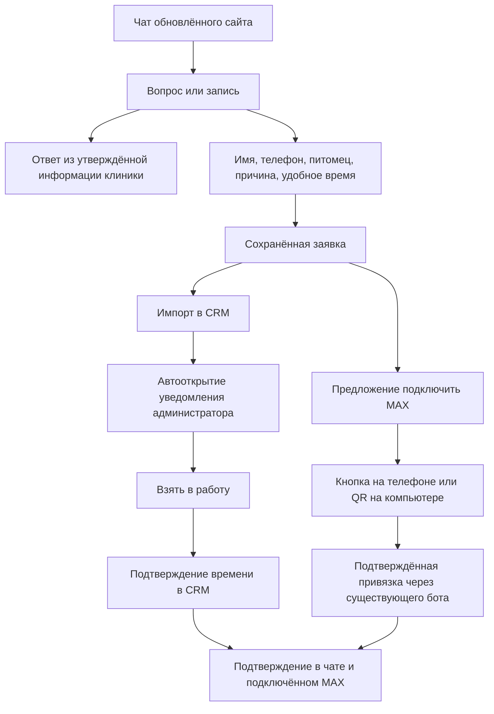
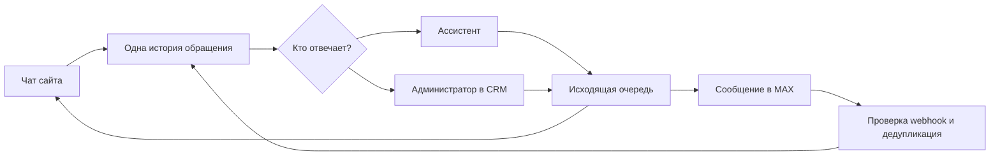
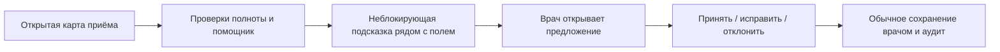

# Ассистент клиники: сайт, MAX, CRM

План от 08.10.2026, принят пользователем к последовательной реализации во внутренней CRM. Звонки и СМС вне первого этапа. «По ИП» предварительно понято как «по ИИ».

## Основная задача, уточнение пользователя 08.10.2026

Ассистент предназначен для владельцев животных и посетителей сайта клиники Темичев Vet. Главная задача — помочь человеку записаться на приём и обратиться в клинику: выяснить цель обращения, предложить подходящую разрешённую услугу и время либо передать заявку администратору CRM. Общение и информация о клинике поддерживают эту задачу.

Ассистент не ставит диагноз, не назначает лечение и препараты, не подбирает дозировки и не даёт медицинских указаний. Такие вопросы передаются администратору для организации приёма/связи с врачом. Он может сообщать утверждённые адрес, часы работы и контакты. Цены должны поступать только из действующего опубликованного каталога клиники; неизвестная или устаревшая цена не придумывается. Сейчас публичный каталог цен существует отдельно, но ответы нового ассистента по прайсу ещё не подключены: вопрос о стоимости передаётся администратору. Это уточнение следующей доработки, не прошедшая функция внутреннего пилота.

Гость сайта может оставить заявку без регистрации. Авторизованный владелец выбирает своего питомца и действительный свободный слот при включённых правилах самостоятельной записи. Администратор видит обращение в CRM и продолжает ту же переписку. Публикация новой версии для всех посетителей и настоящий канал MAX ещё не выполнялись.

## Текущее выполнение
Реализован внутренний пилот: заметная карточка администратора с ответственным и отложенными обращениями, чат и переписка с устойчивой передачей в CRM, ручное подтверждение записи, интеграция существующего MAX-бота, контекстный черновик врача с явным принятием, самостоятельная запись владельца по действующим правилам расписания и настройки сервисных напоминаний. Всё проверяется на вымышленных данных; рабочая клиническая база, сайт и живые webhooks не менялись.

По прямому указанию пользователя 08.10.2026 напоминания включены у владельца по умолчанию: общий переключатель и все четыре типа. Владелец может выключить отдельный тип либо всё сразу. Сохранённое отключение не сбрасывается при входе, синхронизации и миграции. Ответы MAX по отдельной беседе и сервисные напоминания зарегистрированного владельца остаются разными разрешениями. Доставка учитывает тихие часы 22:00–08:00 и дневной лимит; перенос/отмена аннулируют прежнее напоминание. Флаги нового канала в production ещё не включались.

Диалог сохраняет выбранные услугу и дату, уточняет неоднозначность, предлагает только разрешённые услуги и реальные свободные интервалы CRM. После выбора своего питомца, времени и двух согласий сервер атомарно подтверждает приём. Повтор сообщения/подтверждения и перезагрузка не создают второй приём. Гость передаёт заявку администратору. Личный кабинет отдельно показывает дату повторного визита; напоминание не выдается за подтверждённую запись.

Пользователь выбрал существующий OpenAI ключ проекта «темичев вет бот» через действующий мост в Нидерландах. Сам ключ остаётся на мосту; клиент обращается к gateway. В расширенной проверке выполнены 50 вымышленных разговоров: исходная классификация модели совпала в 46 случаях. Все четыре расхождения безопасно передавались человеку; после добавления серверного приоритета клинических вопросов и просьб администратора эти четыре случая повторно прошли. Итоговый маршрутизатор прошёл 50/50 сценариев; это не утверждение о 100% точности LLM. В этом этапе 60 платных вызовов, 24208 входных и 1163 выходных токена. Модель определяет намерение и извлекает буквальные фрагменты; ответы строятся из проверенных шаблонов. Голос и локальная LLM не добавлялись. Постоянный локальный QA оставляет модель выключенной.

Подготовлена отдельная страница `/assistant` на owner-gateway без входа сотрудника, использующая те же запись и настройки. В личном кабинете ссылка показывается только при включённом пилоте. Чат и кабинет находятся на одном origin, что позволяет использовать действующую сессию владельца. Выход и смена владельца закрывают прежнюю историю. Страница закрыта от индексации; embedding в iframe не разрешён политикой шлюза. Конкретный выпуск обновлённого сайта остаётся отдельным этапом; пакет и пример кнопки подготовлены в `docs/plans/2026-10-08-clinic-assistant-release.md`.

Последняя общая регрессия: 477 тестов, 467 PASS/0 FAIL/10 SKIP; явный PostgreSQL набор всех частей ассистента: 65 PASS/0 FAIL/0 SKIP. Сборки API/gateway/web, отдельная сборка публичного чата и локальный Docker-пакет прошли. Docker-пакет проверен без сети, архитектура arm64; целевой production linux/amd64 образ предстоит квалифицировать перед будущим выпуском. В браузере проверены чат → CRM → ответ, самостоятельная запись и reload, даты повторного визита, default-on и сохранение отписки. Снимки изображения в последних проверках завершились timeout: доказательства DOM/HTTP/БД не заменяют визуальную приёмку.

Доказательства: `outputs/assistant-20261008/QA-REPORT.md`, `outputs/assistant-20261008/ACCEPTANCE.md`. Публикация и настоящие сообщения владельцам не выполнялись. Исходные наблюдения ниже сохраняются как основание плана, не описывают сегодняшнее состояние production.

## Основа, проверенная в исходниках
- apps/owner-gateway/src/max-webhook.service.ts: обрабатывается bot_started, приглашение и привязка аккаунта владельца. В этом обработчике обычные сообщения не поддерживаются.
- apps/api/src/modules/online-requests/owner-gateway-booking-sync.service.ts: импорт заявок с дедупликацией externalRequestId. Импорт заявки не является подтверждённой записью.
- apps/web/src/layouts/GlobalOperationalAlerts.tsx: баннеры, опрос staff-alerts каждые 30 секунд. Просмотр помечает уведомление прочитанным; это не принятие ответственности за заявку.
- apps/web/src/layouts/useLiveUpdates.ts: существует SSE-механизм обновлений; для очереди обращений нужны отдельные события и восстановление пропущенных событий.
- apps/api/src/modules/notifications/notification-dispatcher.service.ts: автоматическая отправка через MESSENGER; другие каналы отклоняются.
Эти наблюдения относятся к локальному исходному коду, не подтверждают состояние production.

## 1. Владелец: обращение и запись

Для первого пилота время подтверждает администратор. Следующий этап — самостоятельная запись ассистентом через тот же проверенный API с атомарным резервированием времени, ограничениями врача/кабинета/длительности и ключом идемпотентности. Ответ «Вы записаны» допустим только после успешного подтверждения CRM.

Зарегистрированный и авторизованный владелец использует существующую привязку; гостю разрешены общие вопросы и новая заявка. Знание телефона не открывает чужую карту и не доказывает владение аккаунтом. Приглашение MAX должно быть короткоживущим, одноразовым и связанным с проверенной сессией/процедурой подтверждения; существующий обработчик отдельно проверить на повторное использование и перепривязку. Не передавать телефон или сведения пациента в QR открытым текстом.

## 2. Единая переписка

Историю связывать только после подтверждения принадлежности. При «Взять в работу» бот прекращает самостоятельные ответы в этой беседе до возврата управления. Каждое сообщение имеет автора, канал, время и статус отправки. Принятие API провайдера не обозначать как прочтение. Возможности входящих событий, кнопок и статусов MAX проверить по актуальной документации перед реализацией; не обещать их по наличию регистрационного бота.

Уведомления: подтверждение/перенос/отмена приёма, напоминание, повторный визит и вакцинация по подтверждённой дате CRM. По прямому указанию пользователя 08.10.2026 все четыре типа сервисных уведомлений включены у владельца по умолчанию; владелец может отключить отдельный тип или все напоминания сразу. Сохранённая отписка не сбрасывается при входе, повторной синхронизации или миграции. Канал первого этапа — MAX, подключённый через регистрацию личного кабинета. Привязка отдельной беседы даёт ответы только по этой беседе. Тихие часы по умолчанию 22:00–08:00 в часовом поясе владельца, дневной лимит 3 сообщения. После переноса или отмены прежнее напоминание аннулируется. При заблокированном боте показать администратору необходимость связаться другим способом, не повторять бесконечно. При неопределённой доставке новый запрос с тем же ключом проверяет прежний результат; новая отправка запрещена. Начатую внешнюю отправку нельзя гарантированно отозвать.

## 3. Обязательные уведомления администратора
События первого этапа: новая заявка; новое сообщение владельца, требующее ответа; просьба связаться с человеком; запрос переноса/отмены; ошибка доставки подтверждения.

При новой заявке автоматически открывается заметная карточка поверх текущего раздела CRM:

> Новая заявка на приём
> Источник: чат сайта / MAX. Время ожидания.
> Владелец, питомец, причина обращения, желаемое время.
> [Взять в работу] [Открыть переписку] [Напомнить через 2 минуты]

Это не исчезающий toast. Карточка не переводит на другую страницу и не уничтожает незавершённую форму. Один открытый блок с очередью следующих событий, без каскада окон. Новое сообщение текущей открытой беседы не перекрывает её повторно. При вводе текста не перехватывать фокус; окно появляется визуально, управление доступно с клавиатуры.

Состояния: НОВОЕ → ВЗЯТО В РАБОТУ → РЕШЕНО; отдельно показано/просмотрено/отложено. Закрытие окна и переход по ссылке не означают обработки. Автор принятия и время сохраняются на сервере. Одновременное принятие двумя администраторами: один победитель, второй видит ответственного. Изменения синхронизируются между компьютерами и вкладками.

Предлагаемые настройки пилота: повтор через 2 минуты, эскалация дежурному/старшему через 5 минут. Это проектные значения, а не утверждённое правило. После окончания смены незавершённые обращения передаются следующей смене, а не исчезают.

В активной CRM — окно обязательно. Звуковой сигнал после включения звука пользователем, без обещания обойти ограничения браузера. Системные уведомления — дополнение с разрешением пользователя; показ при закрытом браузере зависит от платформы и отдельно тестируется. В системном уведомлении не показывать медицинские подробности. Если нет активного администратора — очередь сохраняется и используется согласованный резервный канал.

## 4. Помощник врача

Начать с административно-документальных задач: незаполненные обязательные поля, незавершённый приём, черновик выписки из введённых врачом данных, подготовка текста владельцу, личные формулировки врача. Не придумывать отсутствующие результаты, диагнозы или назначения. Для каждого предложения показывать источник и отсутствующие сведения; врач принимает текст явно. Не сохранять молча и не отправлять владельцу автоматически.

Подсказки появляются по событию и контексту, не по таймеру; обычные советы — компактно рядом с полем/в боковой панели, а не чередой модальных окон. Врач может отложить или отключить тип подсказок. Никакой автоматической диагностики и изменения дозировок в первом этапе. Клинические рекомендации — отдельный будущий этап с проверенными источниками и врачебной валидацией.

## 5. Надёжность и границы
Облачный чат принимает обращения при недоступности локальной CRM; хранит их в устойчивой очереди. Владелец видит «Заявка получена, время ещё не подтверждено». После восстановления связи — однократный импорт и проверка актуальности. Локальные действия администратора при доступной локальной сети не должны зависеть от облачного AI. Внешний MAX и сайт требуют интернета.

Модель не получает прямой доступ к БД. Ограниченные серверные операции проверяют права, доступность времени, привязку владельца и разрешённые переходы состояний. Текст клиента — данные, не инструкция изменить системные права. Доступ персонала по ролям, журнал действий, минимальный объём передаваемых данных и заранее выбранные условия хранения у AI-провайдера.

## 6. Очерёдность и приёмка
1. Уведомления администратора и серверная очередь принятия: можно проверять независимо от AI.
2. Чат сайта → заявка CRM → ручное подтверждение → существующий бот MAX.
3. Входящие сообщения MAX и передача беседы человеку.
4. Контекстные подсказки врачу на тестовых данных.
5. Самостоятельное бронирование ассистентом после проверки конфликтов и повторов.

Обязательные тесты: повтор webhook не создаёт дубль; два клиента не занимают один слот; два администратора не принимают одну заявку одновременно; новая заявка автоматически видна из любого раздела; перезагрузка/новая вкладка не теряет очередь; отложенная заявка появляется снова; обрыв и восстановление связи не создают повторных записей и сообщений; ручная форма не теряет ввод; истёкший/повторный QR не привязывает чужого владельца; перенос аннулирует старое напоминание; бот замолкает при принятии беседы; предложения врачу без подтверждения ничего не меняют.

Перед разработкой уточнить: актуальный исходник обновлённого сайта и действующего бота, ответственного администратора/смены, сроки эскалации, процесс подтверждения нового владельца и разрешённую среду AI. Никаких реальных рассылок и изменений клинических данных на этапе подготовки.
