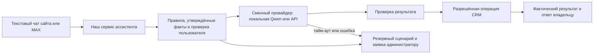

# Текстовая модель для ассистента клиники

Проверка и расчёт: 08.10.2026. Модель не установлена на клинический сервер. Голос, звонки и СМС не входят в этот выбор. Полная цель ассистента остаётся активной.

Выбор пользователя: существующий OpenAI ключ проекта «темичев вет бот», запросы через свой мост в Нидерландах. Наличие ключа и GPT-4o mini в настройках проекта подтверждено без раскрытия значения. На мосту работают `temichevvet_openai_gateway.service` и его туннель. Gateway принимает `POST /v1/chat/completions` и сам подставляет ключ OpenAI; новому клиенту нужен токен gateway. Рабочие службы не менялись. Восемь вымышленных запросов через этот маршрут прошли, задержка от971 до1958мс, суммарная оценка по usage и тарифу $0,000496. Ещё3 сценария прошли весь backend путь «чат → устойчивая очередь → настоящая модель → ответ/передача в CRM»: адрес, заявка на запись, клинический вопрос. Всего11 вызовов, оценка $0,000695. Это небольшой тест, не стоимость полного диалога и не общая приёмка качества. Отчёты: `outputs/assistant-20261008/openai-bridge-live-qa.json`, `openai-chat-live-qa.json`. Ключ OpenAI остаётся на мосту; токен gateway использовался в памяти, не сохранялся в CRM или отчёте. Включение модели в рабочий чат и production deployment ещё не выполнены.

В очереди ассистента добавлен общий резерв $1/сутки и $10/месяц по умолчанию с проверкой до вызова. Эти лимиты относятся только к новому пути ассистента, а не к расходам других приложений на том же ключе. При неопределённом результате платный запрос не повторяется, резерв сохраняется, обращение передаётся человеку. Постоянный QA стенд не выполняет платные вызовы автоматически.

## Что действительно требует модели

Код CRM отвечает за сохранение заявки, проверку владельца, расписание, конфликт времени, подтверждение записи, очередь сообщений и уведомление администратора. Эти операции не должны зависеть от успешного ответа LLM. Текущее правило `clinic-chat-policy.ts` уже позволяет принимать обращения без модели, но понимает ограниченный набор формулировок.

LLM полезна для свободных формулировок, опечаток, уточняющих вопросов, извлечения пожеланий из переписки и подготовки текста из утверждённых фактов. Модель не получает прямой доступ к базе и не может своим текстом подтвердить несуществующую запись. Помощник врача готовит проверяемый черновик; принятие текста остаётся явным действием врача.

Собственный сервис-провайдер можно написать: он принимает запрос от нашего ассистента и обращается либо к локальной Qwen, либо к выбранному API. Это сохраняет наши правила и позволяет менять поставщика. Обучать новую LLM с нуля для этой задачи не требуется. Полностью сценарный бот тоже возможен, но сложную свободную переписку он чаще передаст администратору.

## Реальный сервер

Короткая проверка через существующий SSH выполнена только на чтение, примерно в 12:15 МСК 08.10.2026:

- компьютер WIN-I123AM83GR4;
- AMD Ryzen 5 7535HS, 6 ядер / 12 потоков;
- видимая Windows память 15,29 GiB, свободно в момент проверки 7,53 GiB;
- нагрузка CPU в момент проверки 2%; встроенная AMD Radeon Graphics;
- установка, перезапуск, изменение сети и данных не выполнялись.

Низкая мгновенная нагрузка не доказывает запас во время резервного копирования, массовой работы и обновления. GPU-поле AdapterRAM из Windows CIM не является полной оценкой разделяемой графической памяти. Скорость LLM и влияние на CRM не измерены.

| Локальный кандидат | Файл весов | Оценка памяти процесса при коротком контексте и одном запросе | Решение для этого сервера |
| --- | ---: | ---: | --- |
| Qwen3 1.7B Q8_0 | 1,83 GB | 2,5–4 GiB | Лёгкий кандидат для понимания простых намерений; качество свободного диалога проверить |
| Qwen3 4B Q4_K_M | 2,50 GB | 3,5–5,5 GiB | По памяти помещается, подходит для ограниченного испытания |
| Qwen3 8B Q4_K_M | 5,03 GB | 6–9 GiB | При текущих свободных 7,53 GiB оставляет недостаточный запас для совместной работы |

Размеры файлов подтверждены в официальных репозиториях [Qwen 1.7B](https://huggingface.co/Qwen/Qwen3-1.7B-GGUF/tree/main), [4B](https://huggingface.co/Qwen/Qwen3-4B-GGUF/tree/main), [8B](https://huggingface.co/Qwen/Qwen3-8B-GGUF/tree/main). Диапазоны RAM — инженерные оценки, не результаты запуска; длинная история, несколько запросов и настройки кеша увеличивают расход. Эти небольшие модели выбраны как доступные кандидаты, без утверждения, что это самые новые модели семейства.

Для испытания 4B: отдельный процесс, один одновременный запрос, контекст 2048–4096 токенов, короткие ответы, ограничение времени и числа потоков CPU. Сначала измерить на тестовой машине, затем отдельно проверить совместную нагрузку с CRM. GPU-ускорение через подходящий runtime оценивать по результату измерения. Не устанавливать модель на работающий клинический сервер только на основании размера файла.

## Расчёт стоимости API

Это гипотетическая нагрузка, число реальных обращений клиники пока не измерялось. Принято 30 дней в месяце и суммарно на один диалог 10 000 входящих и 2 000 исходящих токенов за все его обращения к модели. Вход включает инструкции, историю, факты и результаты наших операций. Токены не равны словам. Длинные рассуждения и повторы сверх этого объёма увеличивают цену.

При 30 диалогах в день: 900 диалогов, 9 млн входящих + 1,8 млн исходящих токенов. При 100: 3 000 диалогов, 30 млн + 6 млн. Формула: входящие миллионы × тариф входа + исходящие миллионы × тариф выхода. Кеш, бесплатные квоты, Batch/Flex и акции не применялись.

| Вариант | Вход / выход за 1 млн токенов | 30 диалогов/день, месяц | 100 диалогов/день, месяц |
| --- | --- | ---: | ---: |
| Qwen3.7 Flash, Alibaba International, запрос ≤32K | $0,03 / $0,13 | $0,504 ≈ 43 ₽ | $1,68 ≈ 144 ₽ |
| Qwen3.8 Flash, Alibaba International | $0,15 / $0,47 | $2,196 ≈ 188 ₽ | $7,32 ≈ 626 ₽ |
| GPT-6 Luna, OpenAI Standard, короткий контекст | $0,10 / $0,50 | $1,80 ≈ 154 ₽ | $6 ≈ 513 ₽ |
| GPT-4o mini, выбранный кандидат OpenAI | $0,15 / $0,60 | $2,43 ≈ 208 ₽ | $8,10 ≈ 692 ₽ |
| GPT-4.1 mini, кандидат для сравнения OpenAI | $0,40 / $1,60 | $6,48 ≈ 554 ₽ | $21,60 ≈ 1 846 ₽ |
| DeepSeek-V4.1-Flash напрямую | $0,15–0,30 / $0,60–1,20 | $2,43–4,86 ≈ 208–415 ₽ | $8,10–16,20 ≈ 692–1 385 ₽ |
| Alice AI LLM Flash, Yandex | 100 ₽ / 200 ₽ | 1 260 ₽ | 4 200 ₽ |
| Qwen3.6 35B, Yandex | 200 ₽ / 300 ₽ | 2 340 ₽ | 7 800 ₽ |
| DeepSeek-V4.1-Flash, Yandex | 300 ₽ / 500 ₽ | 3 600 ₽ | 12 000 ₽ |
| YandexGPT Lite, Yandex | 200 ₽ / 200 ₽ | 2 160 ₽ | 7 200 ₽ |

Официальные тарифы: [Alibaba Model Studio](https://www.alibabacloud.com/help/en/model-studio/model-pricing), [OpenAI API](https://developers.openai.com/api/docs/pricing), [DeepSeek API](https://api-docs.deepseek.com/quick_start/pricing/), [Yandex AI Studio](https://aistudio.yandex.ru/ru/docs/ai-studio/pricing). У Alibaba взят Singapore International; цена 3.7 Flash увеличивается при запросе более 32K. Для DeepSeek диапазон соответствует внепиковым и пиковым часам; часы указаны у провайдера в UTC. Использовать короткий диалоговый режим без длительных рассуждений.

Перевод долларов только для сравнения: [курс ЦБ на 08.10.2026](https://www.cbr.ru/currency_base/daily/?UniDbQuery.Posted=True&UniDbQuery.To=08.10.2026), 85,4811 ₽/$; это не курс списания с карты. Рублёвые тарифы Yandex включают НДС. Для зарубежных цен комиссии, налоги и способы оплаты не проверены. Расчёт исключает хостинг, MAX/СМС, сопровождение и работу разработчика. Не является предложением на оплату.

Без LLM: 0 за токены, сохраняются затраты на инфраструктуру. Локальная Qwen: 0 за токены, но есть электричество, ресурсы CRM и сопровождение. Покупать отдельный сервер ради экономии на API при такой нагрузке пока нет основания.

## Пригодность и выбор

После уточнения пользователя первым тестируется GPT-4o mini через действующий NL gateway, с переиспользованием существующего ключа. GPT-4.1 mini — второй кандидат, если первый не проходит одинаковую приёмку. Цены проверены в официальных карточках [GPT-4o mini](https://developers.openai.com/api/docs/models/gpt-4o-mini) и [GPT-4.1 mini](https://developers.openai.com/api/docs/models/gpt-4.1-mini). GPT-4.1 nano дешевле ($0,10/$0,40), но его [карточка](https://developers.openai.com/api/docs/models/gpt-4.1-nano) помечена Deprecated, поэтому новым базовым вариантом его не выбираем. Техническая доступность через мост и условия использования аккаунта — отдельные проверки; размещение моста не меняет список поддерживаемых стран OpenAI.

Ниже сохранено первоначальное сравнение альтернатив до выбора пользователя:

1. Для практического пилота в клинике: наш сценарный контур + сменный API, сначала сравнить Alice AI LLM Flash и Qwen3.6 через Yandex. Первая дешевле в этом расчёте, вторая — отдельный кандидат для качества; превосходство пока не доказано. Yandex публикует рублёвые тарифы и [OpenAI-совместимые интерфейсы моделей](https://aistudio.yandex.ru/ru/docs/ai-studio/concepts/generation/models). Учётная запись, доступные конкретному аккаунту модели и ключ ещё не проверялись.
2. Для минимальной цены модели: Qwen3.7 Flash напрямую через Alibaba — самый дешёвый из рассчитанных облачных вариантов. Нужно отдельно подтвердить доступность аккаунта, оплаты и выбранного региона; цена сама по себе не доказывает качество русского диалога или доступность для нашей клиники.
3. OpenAI GPT-6 Luna пригодна как кандидат: поддерживает [function calling и structured outputs](https://developers.openai.com/api/docs/models/gpt-6-luna). Однако России нет в [официальном списке поддерживаемых стран](https://developers.openai.com/api/docs/supported-countries). Поэтому прямой OpenAI API не считать подтверждённой основой для клиники в РФ. Подписка пользователя на ChatGPT/Codex не подтверждает доступ к оплачиваемому API.
4. Для офлайн-испытания: Qwen3 4B в отдельном ограниченном процессе. Она должна сначала пройти тесты качества, задержки и влияния на CRM; сейчас есть только подтверждение характеристик сервера и оценка размещения в памяти.
5. Если «Xixi» означает DeepSeek, варианты выше покрывают прямой API и размещение через Yandex. Название пока не подтверждено пользователем.

## Архитектура без привязки к модели

Внешнему API передавать минимум нужных данных; телефоны, полные карты и несвязанные записи остаются вне модельного запроса. Внутренние испытания — на вымышленных данных. Дневной и месячный лимиты расходов должны проверяться нашим сервисом до запроса, а не только задаваться уведомлением в кабинете поставщика. Ошибка модели не должна терять заявку, блокировать обычную CRM или порождать бесконтрольный повтор платных запросов.

Для Yandex при подключении отдельно настроить хранение: [официальная политика](https://aistudio.yandex.ru/ru/docs/ai-studio/concepts/security/data-storage) допускает сохранение запросов для улучшения сервиса по умолчанию. Отключение такого логирования не отключает отдельно включённый трейсинг. Для Responses API сохранение ответа можно выключить через `store:false`; историю нашей переписки хранить у нас. Эти настройки пока не менялись, они являются требованием будущего подключения.

Локальная модель позволяет внутреннему помощнику работать без интернета, если локальная сеть и CRM доступны. Внешний сайт и MAX требуют связи: локальная LLM не устраняет зависимость этих каналов от интернета.

## Одинаковая приёмка кандидатов

Сначала тестовый набор минимум 50 вымышленных диалогов: обычная запись, опечатки, неоднозначная дата, несколько питомцев, занятое время, повтор сообщения, отмена/перенос, незарегистрированный владелец, чужая карта, просьба оператора, вопрос о лекарствах, попытка изменить правила бота, недоступность API/CRM и отказ от MAX.

Отдельно измерить правильность намерения и полей, опору ответа на утверждённые факты, отсутствие выдуманного подтверждения записи, число обращений к администратору, полный расход токенов и p50/p95 времени ответа. Нулевой допуск к доступу к чужим данным и к подтверждению записи без результата CRM. Тексты лекарственных назначений не считать административной задачей чата.

Для локального кандидата добавить нагрузочную проверку параллельно обычной CRM: свободная память, CPU, задержка API и календаря; остановить испытание при заметном ухудшении. Для облачных кандидатов проверять потерю соединения и сохранение заявки. До этих измерений нельзя объявлять какой-либо вариант самым качественным или самым быстрым для нашей системы.

Данные и расчёты для 30/100/300 диалогов в день: `outputs/assistant-20261008/model-options-costs.json`.
