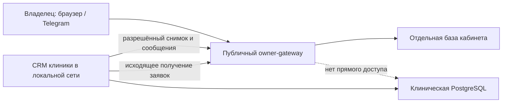

# Коммуникации, Telegram, онлайн-запись и будущий сайт

Дата проектного решения: 30.07.2026.

## Что реализовано в локальном коде

1. Вход через Telegram:
   - первое подключение выполняется только по одноразовому приглашению клиники;
   - webhook Telegram защищён секретом;
   - привязка создаётся только для личного чата, где Telegram ID пользователя совпадает с ID чата;
   - после привязки обычная команда `/start` создаёт новую одноразовую ссылку входа на 10 минут;
   - браузер получает `HttpOnly` cookie, а исходный токен погашается один раз.
2. Сообщения и Telegram-рассылка:
   - персональное сообщение всегда сохраняется в защищённом кабинете;
   - MAX и Telegram являются дополнительными каналами;
   - рассылка Telegram сначала показывает аудиторию;
   - в одной операции допускается не более 500 владельцев;
   - постановка в очередь доступна только после точного ввода слова `ОТПРАВИТЬ`;
   - каждая доставка остаётся отдельной строкой локальной очереди и попадает в аудит.
3. Онлайн-запись:
   - форма доступна в локальном кабинете CRM и в публичном owner-gateway;
   - владелец выбирает своего пациента, желаемое время и оставляет комментарий;
   - заявка не создаёт приём автоматически;
   - публичный шлюз хранит заявку отдельно от клинической базы;
   - CRM сама забирает новые заявки исходящим запросом каждые 30 секунд;
   - повторная загрузка не создаёт дубль благодаря `externalRequestId`;
   - после проверки администратор переводит заявку в обычную запись существующим действием CRM.

## Граница безопасности

В push и Telegram нельзя передавать диагноз, результаты анализов, паспортные данные или другие медицинские сведения, которые могут появиться на экране блокировки. Такие сведения доступны только после входа в кабинет.

## Контракт будущего сайта

Сам сайт в этой задаче не создаётся. Для него подготавливается следующий контракт:

- сайт отправляет заявку только в публичный owner-gateway, а не в API клинической CRM;
- рекомендуемый маршрут: `POST /v1/public/booking-requests`;
- обязательные поля: имя, телефон, кличка пациента, согласие на обратную связь, `clientRequestId`;
- дополнительные поля: вид животного, желаемая дата, комментарий, источник, UTM-метки;
- сервер возвращает только публичный номер заявки и статус `received`;
- повтор с тем же `clientRequestId` должен возвращать прежний результат, не создавая дубль;
- новая заявка всегда имеет статус «Ожидает обработки», но не создаёт запись в расписании;
- обязательны HTTPS, ограничение частоты запросов, honeypot/антибот и ограниченный список доменов CORS;
- UTM-метки не должны содержать телефон, медицинский текст или идентификаторы пациента.

Открытый маршрут намеренно не включён до выбора домена сайта и способа антибот-защиты. Это исключает публикацию незащищённой формы «на всякий случай».

## Сценарии приёмки перед публикацией

1. Новый владелец открывает Telegram-приглашение, запускает бота и входит в кабинет.
2. Уже привязанный владелец отправляет `/start` без токена и получает новую кнопку входа.
3. Чужой Telegram ID и групповой чат не получают доступ.
4. Владелец отправляет одну заявку; CRM получает одну заявку даже после повторного опроса.
5. Администратор подтверждает заявку и создаёт запись; до подтверждения расписание не меняется.
6. Предпросмотр рассылки ничего не отправляет.
7. Без слова `ОТПРАВИТЬ` рассылка не создаётся.
8. Владелец без разрешения Telegram не входит в аудиторию рассылки.
9. При недоступном шлюзе клиническая CRM продолжает работать, заявка остаётся в очереди шлюза.

## Что требуется отдельно перед реальным запуском

- домен и HTTPS публичного кабинета;
- токен бота, имя бота и секрет webhook Telegram;
- отдельная PostgreSQL owner-gateway и её миграции;
- одинаковый сильный `OWNER_GATEWAY_SYNC_SECRET` на CRM и шлюзе;
- резервное копирование отдельной базы шлюза;
- проверка текстов согласия и политики обработки персональных данных;
- отдельное разрешение на деплой и настройку webhook.
